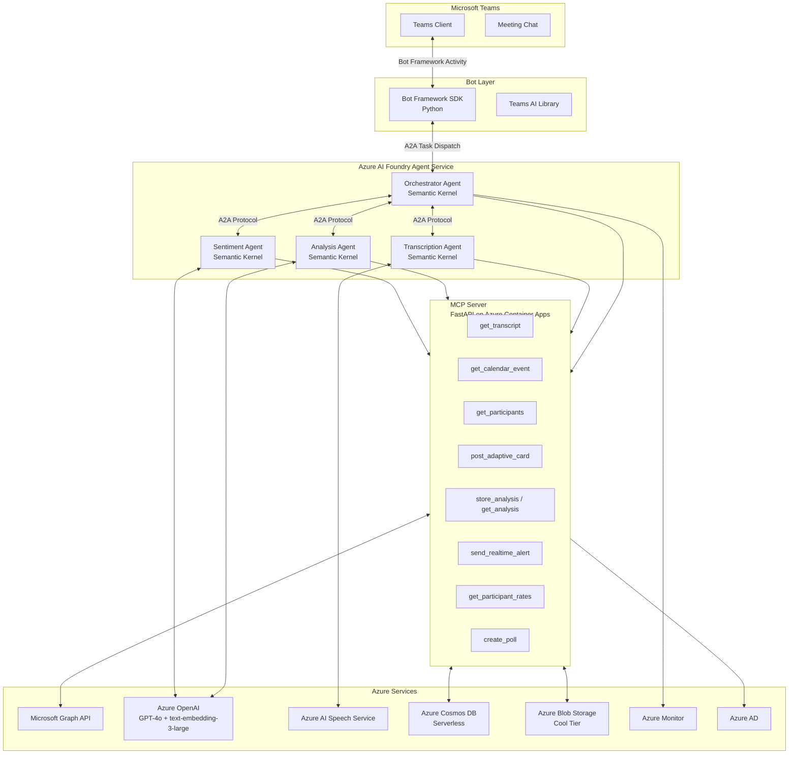
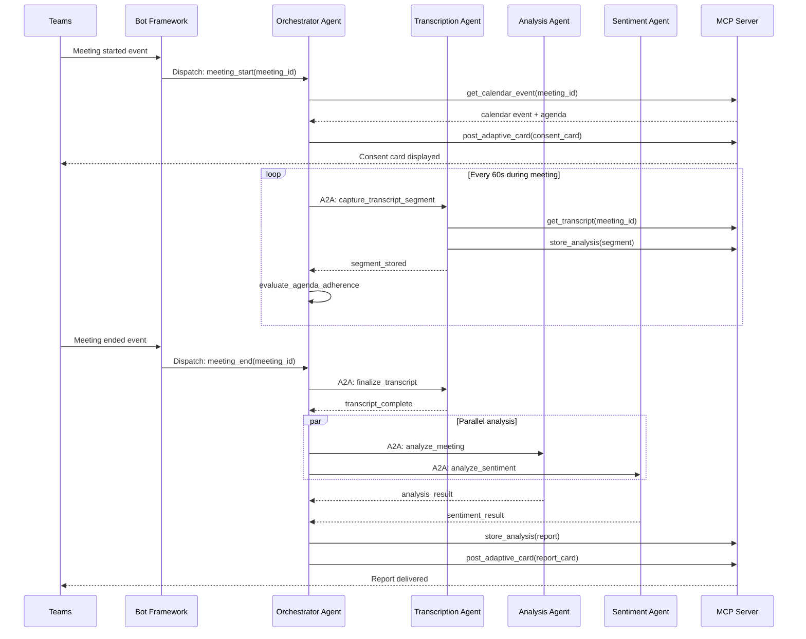
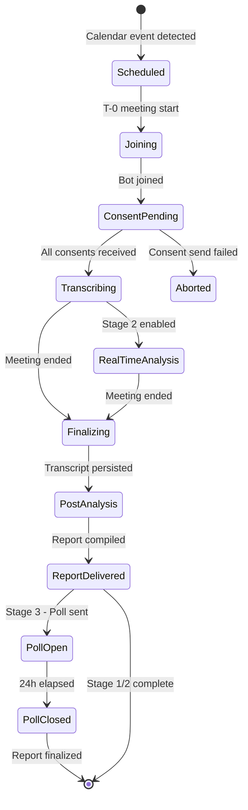
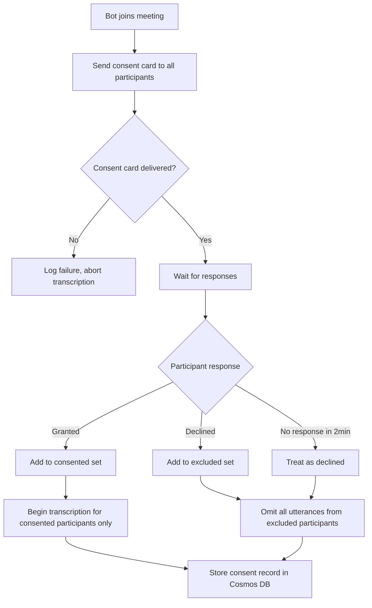

# Design Document: Teams Meeting Analysis Bot

## Overview

The Teams Meeting Analysis Bot is an AI-powered multi-agent system that automatically joins Microsoft Teams meetings, captures transcripts with participant consent, delivers proactive real-time insights during the meeting, and produces a deep post-meeting analysis report. The system is built on Azure AI Foundry with Semantic Kernel orchestration, a self-hosted MCP server, and Microsoft Bot Framework for Teams integration.

### Delivery Stages

| Stage | Timeline | Theme | Key Deliverables |
|---|---|---|---|
| Stage 1 | Weeks 1–2 | Proof of Value | Auto-join, consent, transcription, agenda extraction, post-meeting summary, A2A foundation, MCP core tools |
| Stage 2 | Weeks 3–4 | Real-Time Intelligence | Proactive in-meeting alerts, live cost tracker, extended MCP tools |
| Stage 3 | Weeks 5–6 | Deep Analysis | Sentiment/tone/pitch, agreement detection, relevance assessment, consent poll, audio post-processing |
| Phase 2 | Post-MVP | Extended Platform | Video analysis, historical dashboard, PM tool integrations |

---

## Architecture

### High-Level Component Diagram



### A2A Communication Flow



### Meeting Lifecycle State Machine



---

## Framework Decisions

### Agent Orchestration: Semantic Kernel (Python) with Azure AI Foundry

**Decision: Semantic Kernel (Python) + Azure AI Foundry Agent Service**

Semantic Kernel is chosen over the alternatives for the following reasons:

| Framework | Assessment |
|---|---|
| **Semantic Kernel** | Native Azure AI Foundry integration, built-in A2A protocol support, first-class connectors for Microsoft Graph, Teams Bot Framework, and Azure OpenAI. Production-ready for enterprise Teams deployment. Chosen. |
| LangGraph | Excellent for complex stateful graphs, but requires manual Azure wiring for Foundry, Graph API, and Bot Framework. Adds 2–3 weeks of integration overhead with no functional benefit for this use case. |
| AutoGen | Research-oriented. Not production-ready for enterprise Teams deployment. Lacks stable Azure Foundry integration. |
| CrewAI | Good for role-based agent crews but lacks native Azure ecosystem connectors. Would require the same manual wiring as LangGraph. |

Semantic Kernel's `AgentGroupChat` and `KernelFunction` primitives map directly to the Orchestrator → Specialist agent topology. The Azure AI Foundry Agent Service handles agent hosting, scaling, and the A2A protocol transport layer, eliminating the need to build custom agent communication infrastructure.

### Frontend Dashboard: Fluent UI v9 (Phase 2 Only)

**Decision: Fluent UI v9 for Phase 2 dashboard; Adaptive Cards for all MVP in-meeting UI**

Fluent UI is Microsoft's open-source React component library — the same design system used in Teams, Outlook, and the Azure Portal. For the Phase 2 historical dashboard, Fluent UI v9 ensures the web app looks and feels native inside Teams (same fonts, colors, components, interaction patterns) and provides built-in Teams theme support and accessibility compliance.

For the MVP (Stages 1–3), all in-meeting UI is delivered via Adaptive Cards through the Bot Framework. Fluent UI is not needed until Phase 2.

### MCP Server: Self-Hosted on Azure Container Apps

**Decision: Self-hosted FastAPI MCP server on Azure Container Apps, registered in Azure AI Foundry as a tool provider**

MCP (Model Context Protocol) is an open standard originally from Anthropic, now widely adopted. It is not a managed Azure service — Azure AI Foundry supports MCP by allowing agents to register MCP servers as tool providers, but the server itself must be written and hosted by the developer.

Microsoft provides some pre-built MCP servers (GitHub, Azure DevOps, Bing) but nothing for Teams meeting data or Microsoft Graph meeting resources. Therefore, a custom MCP server is required.

The MCP server is implemented as a lightweight FastAPI (Python) application. Each tool is a thin authenticated wrapper around a Microsoft Graph API call or Azure storage operation — approximately 200–300 lines of Python total. It is hosted as an Azure Container App (serverless, scales to zero, cost-effective) and registered in Azure AI Foundry as a tool provider so all agents can call it uniformly.

---

## Components and Interfaces

### Bot (Teams Bot Framework SDK — Python)

The bot is the Teams-facing entry point. It handles all Teams activity events and delegates intelligence to the Orchestrator Agent.

**Responsibilities:**
- Register as a Teams application via Azure Bot Service and Teams App Manifest
- Subscribe to calendar events via Microsoft Graph webhook to detect new meetings
- Auto-join meetings at scheduled start time using Graph Communications API
- Deliver consent Adaptive Card on join
- Render real-time cost tracker Adaptive Card (Stage 2), updating in-place every 60 seconds
- Deliver post-meeting report Adaptive Card
- Deliver consent poll (Stage 3)

**Key interfaces:**
```
POST /api/messages          # Bot Framework activity endpoint
POST /api/graph/webhook     # Graph change notification webhook
```

**Auto-join flow:** The bot subscribes to `calendarView` change notifications via Graph API. When a new meeting is detected, it schedules a join at the meeting start time using the Graph Communications API `createCall` endpoint, joining as a service participant.

### MCP Server (FastAPI on Azure Container Apps)

The MCP server is the tool layer between agents and external services. Agents never call Graph API or storage directly — all external calls go through MCP tools.

**Tool inventory by stage:**

| Stage | Tool | Description |
|---|---|---|
| 1 | `get_transcript` | Retrieve transcript segments for a meeting ID from Blob Storage |
| 1 | `get_calendar_event` | Fetch meeting metadata and agenda from Graph API |
| 1 | `get_participants` | List meeting participants with display names and job titles from Graph API |
| 1 | `post_adaptive_card` | Send or update an Adaptive Card in a Teams channel or chat |
| 1 | `store_analysis` | Persist analysis results or transcript segments to Cosmos DB / Blob Storage |
| 1 | `get_analysis` | Retrieve prior analysis results from Cosmos DB |
| 2 | `send_realtime_alert` | Send a proactive in-meeting Adaptive Card notification |
| 2 | `get_participant_rates` | Retrieve seniority level and hourly rate per participant |
| 3 | `create_poll` | Create a Teams poll via Adaptive Card for consent validation |

**Authentication:** All agent requests are authenticated via Azure AD managed identity tokens. The MCP server validates the bearer token on every request before executing any tool.

**Error contract:** All tool failures return:
```json
{
  "error": {
    "code": "GRAPH_UNAVAILABLE",
    "message": "Microsoft Graph API returned 503",
    "retryable": true
  }
}
```

### Orchestrator Agent (Semantic Kernel + Azure AI Foundry)

The Orchestrator is the top-level agent. It owns the meeting lifecycle and routes tasks to specialist agents via A2A.

**Responsibilities:**
- Receive meeting lifecycle events from the Bot (join, end)
- Retrieve calendar event and agenda via MCP
- Dispatch transcript capture tasks to Transcription Agent
- Stage 2: Run real-time evaluation loop every 60 seconds — evaluate agenda adherence, trigger alerts
- On meeting end: dispatch parallel analysis tasks to Analysis Agent and Sentiment Agent
- Aggregate results and compile the Analysis Report
- Deliver report via MCP `post_adaptive_card`
- Log all A2A dispatches to Azure Monitor

**Real-time evaluation algorithm (Stage 2):**

```
Every 60 seconds:
1. Take the last 120 seconds of transcript segments (sliding window)
2. Concatenate segment text into a single string
3. Compute cosine similarity between the window embedding and each agenda topic
   embedding (using text-embedding-3-small for speed, pre-computed at meeting start)
4. If max similarity across all topics < 0.35 for 3 consecutive windows (3 minutes),
   trigger off-track alert
5. At T=5min: if no agenda topics have similarity > 0.4 in any window,
   trigger agenda-unclear alert
6. At T=10min: if agenda still unclear, trigger second alert with GPT-4o-generated
   suggested agenda from transcript so far
```

**A2A task schemas:**

```json
// Dispatch to Transcription Agent
{
  "task": "capture_transcript_segment",
  "meeting_id": "string",
  "segment_window_seconds": 60
}

// Dispatch to Analysis Agent
{
  "task": "analyze_meeting",
  "meeting_id": "string",
  "transcript_blob_url": "string",
  "agenda": ["string"]
}

// Dispatch to Sentiment Agent
{
  "task": "analyze_sentiment",
  "meeting_id": "string",
  "transcript_blob_url": "string",
  "audio_blob_url": "string | null"
}
```

**A2A response schemas:**

```json
// Response from Transcription Agent
{
  "task": "capture_transcript_segment",
  "status": "ok | error",
  "segments_captured": "number",
  "blob_url": "string",
  "gap_detected": "boolean",
  "error": "string | null"
}

// Response from Analysis Agent
{
  "task": "analyze_meeting",
  "status": "ok | partial | error",
  "agenda": ["string"],
  "agenda_source": "calendar | inferred | not_determined",
  "agenda_adherence": [],
  "time_allocation": [],
  "action_items": [],
  "sections_failed": ["string"],
  "error": "string | null"
}

// Response from Sentiment Agent
{
  "task": "analyze_sentiment",
  "status": "ok | partial | error",
  "participation_summary": [],
  "sections_failed": ["string"],
  "error": "string | null"
}
```

**Retry policy:** If a specialist agent does not respond within 120 seconds, the Orchestrator retries once. On second failure, the corresponding report section is marked "Unavailable".

### Transcription Agent (Semantic Kernel + Azure AI Foundry)

**Responsibilities:**

Stage 1–2 (live transcript capture):
- Connect to Graph Communications API for live transcript stream
- Attribute each segment to the correct participant via Teams identity
- Buffer and persist segments to Blob Storage every ≤60 seconds
- Omit segments from participants who declined consent
- On meeting end: finalize transcript and notify Orchestrator

Stage 3 (batch audio post-processing — triggered after meeting ends):
- Trigger batch audio post-processing using Azure AI Speech batch transcription and prosody API
- Extract per-participant prosody features (speaking rate, pitch mean/variance) from the full meeting audio recording
- Correlate audio analysis results with transcript timestamps and participant identities
- Persist enriched prosody data to Blob Storage
- Notify Orchestrator when post-processing is complete

Note: No real-time audio processing occurs during the meeting. All audio analysis is deferred to Stage 3 batch post-processing after the meeting ends.

**Key integrations:**
- Microsoft Graph Communications API (`/communications/calls/{id}/transcripts`)
- Azure AI Speech Service (batch prosody analysis — Stage 3 only)
- Azure Blob Storage (transcript and audio persistence)

### Analysis Agent (Semantic Kernel + Azure AI Foundry)

**Responsibilities:**
- Retrieve calendar event and extract agenda (or infer from first 10% of transcript)
- Compute semantic similarity between agenda topics and transcript segments using `text-embedding-3-large`
- Classify agenda topics as Covered / Partially Covered / Not Covered
- Identify off-agenda discussion segments
- Calculate time allocation per agenda topic
- Extract action items using GPT-4o with structured output
- Stage 3: Detect participant agreement/disagreement on action items
- Stage 3: Assess participant relevance to agenda using the formula below

**Participant relevance formula (Stage 3):**

```
Relevance score = (agenda_aligned_speaking_time / total_speaking_time) × 100

Where agenda_aligned_speaking_time = sum of duration of transcript segments
where cosine_similarity(segment_embedding, nearest_agenda_topic_embedding) >= 0.4

Classification:
- score >= 60%: "Highly Relevant"
- score >= 30%: "Relevant"
- score < 30%:  "Low Relevance"
- total_speaking_time == 0: "Observer"
```

**Model usage:**
- `text-embedding-3-large` — agenda vs. transcript semantic similarity
- `GPT-4o` — action item extraction, agreement detection, relevance assessment

### Sentiment Agent (Semantic Kernel + Azure AI Foundry)

**Responsibilities:**
- Compute per-participant sentiment using Azure AI Language Sentiment Analysis API (returns Positive/Neutral/Negative with confidence scores)
- Apply Azure AI Language Opinion Mining to extract aspect-level sentiment on key phrases (no custom labels needed)
- Identify sentiment shifts with timestamps
- Calculate speaking time percentage and turn count per participant
- Flag low participation (<2%) and dominant speakers (>50%)
- Stage 3: Incorporate prosody signals (speaking rate, pitch mean/variance) as raw numeric values in the report — these are not classified into custom labels

**Model usage:**
- Azure AI Language Sentiment Analysis API — text sentiment (Positive/Neutral/Negative)
- Azure AI Language Opinion Mining — aspect-level sentiment on key phrases
- Azure AI Speech prosody features — speaking rate, pitch mean/variance as numeric signals (Stage 3)

---

## Data Models

### Meeting Record

```json
{
  "id": "meeting_{meeting_id}",
  "type": "meeting",
  "meeting_id": "string",
  "organizer_id": "string",
  "organizer_name": "string",
  "subject": "string",
  "start_time": "ISO8601",
  "end_time": "ISO8601 | null",
  "duration_minutes": "number | null",
  "participants": ["participant_id"],
  "consent_status": {
    "{participant_id}": {
      "consented": "boolean",
      "timestamp": "ISO8601"
    }
  },
  "stage": "joining | transcribing | analyzing | complete | aborted",
  "transcript_blob_url": "string | null",
  "audio_blob_url": "string | null",
  "analysis_report_id": "string | null",
  "created_at": "ISO8601",
  "updated_at": "ISO8601",
  "azure_region": "string",
  "retention_expires_at": "ISO8601"
}
```

### Transcript Segment

```json
{
  "id": "seg_{meeting_id}_{sequence}",
  "type": "transcript_segment",
  "meeting_id": "string",
  "sequence": "number",
  "participant_id": "string",
  "participant_name": "string",
  "text": "string",
  "start_time": "ISO8601",
  "end_time": "ISO8601",
  "duration_seconds": "number",
  "prosody": {
    "speaking_rate_wpm": "number | null",
    "pitch_mean_hz": "number | null",
    "pitch_variance": "number | null"
  },
  "consent_verified": "boolean"
}
```

### Analysis Report

```json
{
  "id": "report_{meeting_id}",
  "type": "analysis_report",
  "meeting_id": "string",
  "generated_at": "ISO8601",
  "agenda": ["string"],
  "agenda_source": "calendar | inferred | not_determined",
  "agenda_adherence": [
    {
      "topic": "string",
      "status": "Covered | Partially Covered | Not Covered",
      "similarity_score": "number",
      "time_minutes": "number",
      "time_percentage": "number"
    }
  ],
  "off_agenda_segments": [
    {
      "topic_summary": "string",
      "start_time": "ISO8601",
      "end_time": "ISO8601",
      "duration_minutes": "number"
    }
  ],
  "preamble_duration_minutes": "number",
  "extended_duration_flag": "boolean",
  "action_items": ["action_item_id"],
  "participation_summary": [
    {
      "participant_id": "string",
      "participant_name": "string",
      "speaking_time_seconds": "number",
      "speaking_time_percentage": "number",
      "turn_count": "number",
      "participation_flag": "Low Participation | Dominant Speaker | null",
      "sentiment": "Positive | Neutral | Negative | Insufficient Data",
      "sentiment_shifts": [{"timestamp": "ISO8601", "from": "string", "to": "string"}],
      "opinion_mining_aspects": [{"aspect": "string", "sentiment": "positive | negative | neutral"}],
      "prosody": {
        "speaking_rate_wpm": "number | null",
        "pitch_mean_hz": "number | null"
      },
      "contribution_score": "number | null",
      "relevance": "Highly Relevant | Relevant | Low Relevance | Observer | null"
    }
  ],
  "final_meeting_cost": "number | null",
  "sections_unavailable": ["string"],
  "poll_id": "string | null",
  "poll_status": "pending | open | closed | null"
}
```

### Action Item

```json
{
  "id": "action_{meeting_id}_{sequence}",
  "type": "action_item",
  "meeting_id": "string",
  "sequence": "number",
  "description": "string",
  "owner_participant_id": "string",
  "owner_name": "string",
  "due_date": "ISO8601 | Not Specified",
  "transcript_timestamp": "ISO8601",
  "status": "Proposed | Confirmed | Disputed | Unresolved | Disputed by Poll",
  "agreement_evidence": ["string"],
  "disagreeing_participants": ["string"],
  "poll_responses": {
    "{participant_id}": "Confirm | Dispute | Abstain"
  }
}
```

### Meeting Cost Snapshot

```json
{
  "id": "cost_{meeting_id}_{snapshot_index}",
  "type": "cost_snapshot",
  "meeting_id": "string",
  "snapshot_index": "number",
  "captured_at": "ISO8601",
  "elapsed_minutes": "number",
  "active_participant_count": "number",
  "total_cost": "number",
  "currency": "string",
  "per_participant": [
    {
      "participant_id": "string",
      "participant_name": "string",
      "hourly_rate": "number | null",
      "elapsed_cost": "number | null",
      "excluded": "boolean"
    }
  ],
  "excluded_participant_count": "number"
}
```

### Consent Record

```json
{
  "id": "consent_{meeting_id}_{participant_id}",
  "type": "consent",
  "meeting_id": "string",
  "participant_id": "string",
  "participant_name": "string",
  "decision": "granted | declined | pending",
  "timestamp": "ISO8601",
  "revoked": "boolean",
  "revoked_at": "ISO8601 | null",
  "deletion_triggered": "boolean"
}
```

---

## Storage Design

### Azure Blob Storage Layout

```
Container: transcripts
  /{azure_region}/
    /{meeting_id}/
      /raw_transcript.jsonl          # Streaming transcript segments (JSONL)
      /final_transcript.json         # Finalized complete transcript
      /audio_recording.mp4           # Raw audio (Stage 3 / Phase 2 video)
      /tone_pitch_features.json      # Prosody analysis output (Stage 3)

Container: reports
  /{azure_region}/
    /{meeting_id}/
      /analysis_report.json          # Full analysis report snapshot

Container: exports
  /{azure_region}/
    /{participant_id}/
      /dsar_{request_id}.zip         # Data subject access request exports
```

Access tier: Cool for all containers (infrequent access, cost-optimized).
Lifecycle policy: Auto-delete blobs after configured retention period (30–365 days).

### Cosmos DB Container Design

Database: `meeting-analysis`

| Container | Partition Key | Document Types | Notes |
|---|---|---|---|
| `meetings` | `/meeting_id` | meeting, consent, cost_snapshot | All meeting-scoped documents co-located |
| `analysis` | `/meeting_id` | analysis_report, action_item, transcript_segment | Analysis results per meeting |
| `config` | `/tenant_id` | tenant_config, participant_rates | Tenant-level configuration |

Capacity mode: Serverless (pay-per-request, optimal for variable meeting load).

Indexing policy: Default (all paths indexed) for `meetings` and `config`. Custom policy for `analysis` — index `participant_id`, `status`, `meeting_id` only to reduce RU cost on large transcript segment collections.

### Embeddings Strategy

Embeddings are computed in-memory using numpy cosine similarity for all MVP stages (1–3). Azure AI Search is deferred to Phase 2 when meeting volume exceeds ~50/day.

Agenda topic embeddings are pre-computed at meeting start using `text-embedding-3-small` (for speed in the real-time evaluation loop) and `text-embedding-3-large` (for post-meeting analysis accuracy). All similarity computations run in-process within the Analysis Agent and Orchestrator Agent.

---

## Security and Privacy

### Azure AD App Registration — Minimum Required Permissions

| Permission | Type | Justification |
|---|---|---|
| `OnlineMeetings.ReadWrite.All` | Application | Auto-join meetings via Graph Communications API |
| `Calendars.Read` | Application | Subscribe to calendar events for auto-join |
| `CallRecords.Read.All` | Application | Access meeting transcript data |
| `Chat.ReadWrite.All` | Application | Send Adaptive Cards to meeting chat |
| `User.Read.All` | Application | Retrieve participant display names and job titles |
| `OnlineMeetingTranscript.Read.All` | Application | Read live and stored transcripts |

All permissions are application permissions (no delegated user context required for the bot). Permissions are granted by a tenant administrator during bot installation.

### Managed Identity Authentication

All agent-to-service authentication uses Azure AD managed identity — no secrets or connection strings in code or configuration.

```
Orchestrator Agent → Azure AI Foundry: System-assigned managed identity
MCP Server → Microsoft Graph API: System-assigned managed identity + app registration
MCP Server → Cosmos DB: System-assigned managed identity (Cosmos DB built-in RBAC)
MCP Server → Blob Storage: System-assigned managed identity (Storage Blob Data Contributor)
Bot → Azure Bot Service: System-assigned managed identity
```

### Data Residency Enforcement

- All Azure resources (Cosmos DB, Blob Storage, AI Foundry, Container Apps) are deployed to the tenant's designated Azure region.
- The MCP server validates `azure_region` on every store operation and rejects cross-region writes.
- Graph API calls use region-specific endpoints where available.
- Transcript data is never transmitted outside the configured region boundary.

### Consent Enforcement Pipeline



Consent revocation: If a participant revokes consent post-meeting, the system deletes their transcript segments from Blob Storage and Cosmos DB, re-runs analysis without their data, and updates the stored report — all within 48 hours.

---

## Correctness Properties

*A property is a characteristic or behavior that should hold true across all valid executions of a system — essentially, a formal statement about what the system should do. Properties serve as the bridge between human-readable specifications and machine-verifiable correctness guarantees.*


### Property 1: Consent precedes transcription

*For any* meeting join event, the consent notification card must be sent and acknowledged before any transcript segment is captured or stored. No transcript data should exist in storage for a meeting where the consent card was never successfully delivered.

**Validates: Requirements 2.1, 2.4**

### Property 2: Consent exclusion is total

*For any* meeting transcript and any participant who declined consent, zero transcript segments attributed to that participant should appear in the stored transcript, the analysis report, or any downstream output. This holds regardless of when during the meeting the participant declined.

**Validates: Requirements 2.3, 3.5**

### Property 3: Consent record round-trip

*For any* participant consent decision (granted or declined), storing the consent record and then retrieving it should return the same decision, participant ID, meeting ID, and a non-null timestamp.

**Validates: Requirements 2.5**

### Property 4: Transcript segment attribution invariant

*For any* transcript segment produced by the Transcription Agent, the `participant_id` field must match the Teams identity of the speaker who produced that segment, and the segment must not be attributed to a participant who was not present in the meeting.

**Validates: Requirements 3.2**

### Property 5: Transcript persistence latency invariant

*For any* transcript segment captured during a live meeting, the elapsed time between the segment's `end_time` and its persistence timestamp in Blob Storage must not exceed 60 seconds.

**Validates: Requirements 3.4**

### Property 6: Agenda topic length invariant

*For any* agenda extracted or inferred by the Analysis Agent, every topic string in the resulting ordered list must have a character length of 200 or fewer. No topic string may be null or empty.

**Validates: Requirements 4.3**

### Property 7: Similarity score range invariant

*For any* agenda topic and transcript segment pair processed by the Analysis Agent, the computed semantic similarity score must be a floating-point value in the closed interval [0.0, 1.0].

**Validates: Requirements 5.1**

### Property 8: Agenda classification completeness

*For any* agenda topic that has been processed by the Analysis Agent, the topic's classification must be exactly one of: "Covered", "Partially Covered", or "Not Covered". No topic may have a null or unrecognized classification status.

**Validates: Requirements 5.2**

### Property 9: Time allocation percentages sum to 100

*For any* analysis report, the sum of time allocation percentages across all agenda topics and the preamble segment must equal 100% (within a floating-point tolerance of ±0.1%). Each individual percentage must be a non-negative number.

**Validates: Requirements 6.3**

### Property 10: Action item schema completeness

*For any* action item extracted by the Analysis Agent, the item must contain: a non-empty description, an owner participant ID, a due date field (either a valid date or the string "Not Specified"), a transcript timestamp, and a status of either "Proposed" or "Confirmed".

**Validates: Requirements 7.1, 7.2, 7.3, 7.4**

### Property 11: Sentiment classification validity

*For any* participant with 50 or more words of transcript contribution, the Sentiment Agent must produce a sentiment classification of exactly one of: "Positive", "Neutral", or "Negative". For any participant with fewer than 50 words, the classification must be exactly "Insufficient Data".

**Validates: Requirements 9.1, 9.5**

### Property 12: Speaking time percentages sum to 100

*For any* meeting with at least one consenting participant, the sum of all participant speaking time percentages in the analysis report must equal 100% (within ±0.1%). Each individual percentage must be non-negative.

**Validates: Requirements 10.1**

### Property 13: Participation flagging thresholds

*For any* participant in a meeting, if their speaking time percentage is less than 2%, they must be flagged as "Low Participation"; if their speaking time percentage exceeds 50%, they must be flagged as "Dominant Speaker"; otherwise the flag must be null. These flags are mutually exclusive.

**Validates: Requirements 10.4, 10.5**

### Property 14: Real-time alert rate limiting

*For any* sequence of real-time alerts sent during a meeting, no two alerts of the same alert type should have timestamps within 5 minutes of each other. The alert throttle state must be maintained independently per alert type.

**Validates: Requirements 12.6**

### Property 15: Meeting cost calculation correctness

*For any* set of participants with known hourly rates and a given elapsed meeting duration, the computed total Meeting_Cost must equal the sum of (elapsed_hours × hourly_rate) for each participant with available rate data. Participants with unavailable rates must be excluded from the total and counted in `excluded_participant_count`.

**Validates: Requirements 13.2, 13.5**

### Property 16: Cost snapshot count invariant

*For any* completed meeting of duration D minutes, the number of cost snapshots stored in Cosmos DB must equal floor(D / 5), with each snapshot's `elapsed_minutes` field increasing monotonically by 5.

**Validates: Requirements 13.7**

### Property 17: Poll structure completeness

*For any* analysis report containing N action items, the generated consent poll must contain exactly N poll entries — one per action item — and each entry must offer exactly the three response options: "Confirm", "Dispute", and "Abstain".

**Validates: Requirements 16.2**

### Property 18: Disputed-by-poll majority rule

*For any* action item in a closed poll, if the count of "Dispute" responses is strictly greater than the count of "Confirm" and "Abstain" responses combined (i.e., a strict majority), the action item's status must be set to "Disputed by Poll". Otherwise the status must not be "Disputed by Poll".

**Validates: Requirements 16.5**

### Property 19: Consent revocation deletes all participant data

*For any* participant who revokes consent after a meeting, querying Blob Storage and Cosmos DB for transcript segments attributed to that participant must return zero results after the deletion process completes. The analysis report must be regenerated without that participant's data.

**Validates: Requirements 17.4**

### Property 20: MCP error response structure

*For any* MCP server tool call that fails due to a downstream service error, the response must be a JSON object containing exactly the fields: `error.code` (non-empty string), `error.message` (non-empty string), and `error.retryable` (boolean). No other error format is acceptable.

**Validates: Requirements 19.3**

### Property 21: MCP input validation rejects invalid inputs

*For any* MCP server tool call with input parameters that do not conform to the tool's defined JSON schema, the server must return a validation error response and must not execute the tool's underlying logic. Valid inputs must never be rejected.

**Validates: Requirements 19.4**

---

## Error Handling

### Agent Failure Handling

| Failure Scenario | Detection | Response |
|---|---|---|
| Specialist agent timeout (>120s) | Orchestrator timeout | Retry once; mark section "Unavailable" on second failure |
| Bot fails to auto-join meeting | Join attempt timeout (60s) | Log failure with meeting ID + reason code; notify organizer |
| Consent card delivery failure | Bot Framework activity error | Abort transcription; log failure |
| Transcription connection interrupted | Graph API disconnect event | Reconnect within 10s; log gap with start/end timestamps |
| MCP tool call failure | HTTP error / timeout | Return structured error with `retryable` flag; agent decides retry |
| Audio post-processing failure | Speech Service error | Log failure; mark participant audio analysis as "Unavailable" |
| Report generation exceeds 10 minutes | Orchestrator timer | Send status message to organizer with estimated completion |

### MCP Server Error Codes

| Code | Meaning | Retryable |
|---|---|---|
| `GRAPH_UNAVAILABLE` | Microsoft Graph API returned 5xx | true |
| `GRAPH_FORBIDDEN` | Insufficient Graph API permissions | false |
| `COSMOS_WRITE_FAILED` | Cosmos DB write operation failed | true |
| `BLOB_WRITE_FAILED` | Blob Storage write operation failed | true |
| `VALIDATION_ERROR` | Input parameters failed schema validation | false |
| `CONSENT_REQUIRED` | Operation blocked — participant consent not granted | false |
| `REGION_VIOLATION` | Cross-region data write attempted | false |

### Retry Policy

- MCP tool calls: 3 retries with exponential backoff (1s, 2s, 4s) for retryable errors
- A2A agent dispatch: 1 retry after 120s timeout
- Graph API subscriptions: Automatic renewal 24 hours before expiry
- Blob Storage writes: 3 retries with 500ms backoff

---

## Testing Strategy

### Dual Testing Approach

Both unit tests and property-based tests are required. They are complementary:

- **Unit tests** verify specific examples, integration points, edge cases, and error conditions
- **Property-based tests** verify universal properties across many generated inputs

Unit tests should be focused and minimal — avoid writing unit tests for behaviors already covered by property tests.

### Property-Based Testing

**Library:** `hypothesis` (Python) — the standard property-based testing library for Python, with built-in strategies for generating structured data.

**Configuration:** Each property test must run a minimum of 100 iterations (`@settings(max_examples=100)`).

**Tag format:** Each property test must include a comment referencing the design property:
```
# Feature: teams-meeting-analysis-bot, Property {N}: {property_title}
```

Each correctness property defined above must be implemented by exactly one property-based test.

**Example property test structure:**

```python
from hypothesis import given, settings, strategies as st

# Feature: teams-meeting-analysis-bot, Property 9: Time allocation percentages sum to 100
@given(st.lists(st.floats(min_value=0, max_value=100), min_size=1))
@settings(max_examples=100)
def test_time_allocation_sums_to_100(raw_durations):
    total = sum(raw_durations)
    if total == 0:
        return  # degenerate case
    percentages = [d / total * 100 for d in raw_durations]
    assert abs(sum(percentages) - 100.0) < 0.1
```

### Unit Test Focus Areas

- Bot Framework activity handler routing (meeting start, end, consent response events)
- Consent card rendering — correct Adaptive Card JSON structure
- MCP server tool input validation — schema rejection for each tool
- MCP server error response format — all required fields present
- Agenda extraction from calendar event body (various formats)
- Action item schema validation — all required fields present
- Cost calculation with missing participant rates
- Poll majority rule edge cases (tie, all abstain, single participant)
- Consent revocation — deletion confirmation

### Integration Test Focus Areas

- End-to-end meeting lifecycle with mock Graph API and mock Azure OpenAI
- A2A task dispatch and response handling between Orchestrator and specialist agents
- Blob Storage write/read round-trip for transcript segments
- Cosmos DB write/read round-trip for analysis reports and consent records

---

## Stage-by-Stage Delivery Plan

### Stage 1 — Proof of Value (Weeks 1–2)

**What gets built:**
- Azure AD app registration with minimum required Graph API permissions
- Bot Framework SDK application with Teams App Manifest
- Graph calendar webhook subscription for auto-join
- Consent Adaptive Card delivery and consent record storage
- Transcription Agent: Graph Communications API transcript capture, speaker attribution, Blob Storage persistence
- Analysis Agent: agenda extraction (calendar + inference), agenda adherence scoring (in-memory embeddings), time allocation, action item extraction
- Sentiment Agent: speaking time percentage, turn count, participation flags
- Orchestrator Agent: meeting lifecycle management, A2A dispatch, report compilation
- MCP Server (FastAPI): 6 core tools (`get_transcript`, `get_calendar_event`, `get_participants`, `post_adaptive_card`, `store_analysis`, `get_analysis`)
- Post-meeting Adaptive Card report delivery
- Cosmos DB + Blob Storage setup with data residency enforcement
- Azure Monitor logging for A2A dispatches and failures

**Dependencies:** Azure AI Foundry workspace, Azure OpenAI deployment (GPT-4o + text-embedding-3-large), Azure Bot Service registration, Teams tenant admin consent for Graph API permissions.

**Stage 1 demo:** Bot auto-joins a scheduled Teams meeting, sends consent card, captures transcript, and delivers a post-meeting Adaptive Card showing agenda adherence, time allocation, action items, and participation breakdown.

---

### Stage 2 — Real-Time Intelligence (Weeks 3–4)

**What gets built:**
- Orchestrator real-time evaluation loop (60-second polling against live transcript)
- Agenda clarity detection (5-minute and 10-minute alert triggers)
- Off-track detection (3-consecutive-minute deviation trigger)
- Alert throttling (max 1 alert per type per 5-minute window)
- Real-time Meeting Cost Tracker Adaptive Card (in-place update every 60 seconds)
- MCP Server extended with 2 tools: `send_realtime_alert`, `get_participant_rates`
- Participant rate data store in Cosmos DB `config` container
- Final meeting cost included in Analysis Report

**Dependencies:** Stage 1 complete. Participant rate data populated in Cosmos DB.

**Stage 2 demo:** During a live meeting, the bot sends an agenda clarity alert at the 5-minute mark, detects an off-topic discussion and sends a refocus alert, and displays a live cost tracker card that updates every minute showing total cost and per-participant breakdown.

---

### Stage 3 — Deep Analysis (Weeks 5–6)

**What gets built:**
- Azure AI Speech Service integration for real-time prosody analysis during meetings
- Tone and pitch feature extraction and Blob Storage persistence alongside transcript segments
- Audio post-processing pipeline triggered on meeting end (batch Speech API)
- Sentiment Agent extended: combined text + audio engagement score, tone classification
- Analysis Agent extended: participant agreement detection on action items, participant relevance assessment
- Consent poll delivery via `create_poll` MCP tool (Adaptive Card poll)
- Poll response collection and 24-hour close timer
- Analysis Report update with poll results and "Disputed by Poll" reclassification
- MCP Server extended with 1 tool: `create_poll`

**Dependencies:** Stage 2 complete. Azure AI Speech Service deployment with prosody analysis enabled.

**Stage 3 demo:** Post-meeting report includes per-participant sentiment classification, tone labels, engagement scores, agreement status on each action item with supporting transcript excerpts, and participant relevance ratings. A consent poll is sent to all participants and the report is updated when the poll closes.

---

### Phase 2 — Post-MVP (Post Week 6)

**What gets built:**
- Historical analysis dashboard (React + Fluent UI v9, Azure Static Web App)
- Azure AD SSO for dashboard
- Aggregated metrics across meetings (agenda adherence trends, cost trends, participation trends)
- Microsoft Planner / Jira action item sync
- Video analysis pipeline (Azure AI Vision, requires separate consent)

**Dependencies:** Stage 3 complete. Sufficient meeting history in Cosmos DB for meaningful trend analysis.
