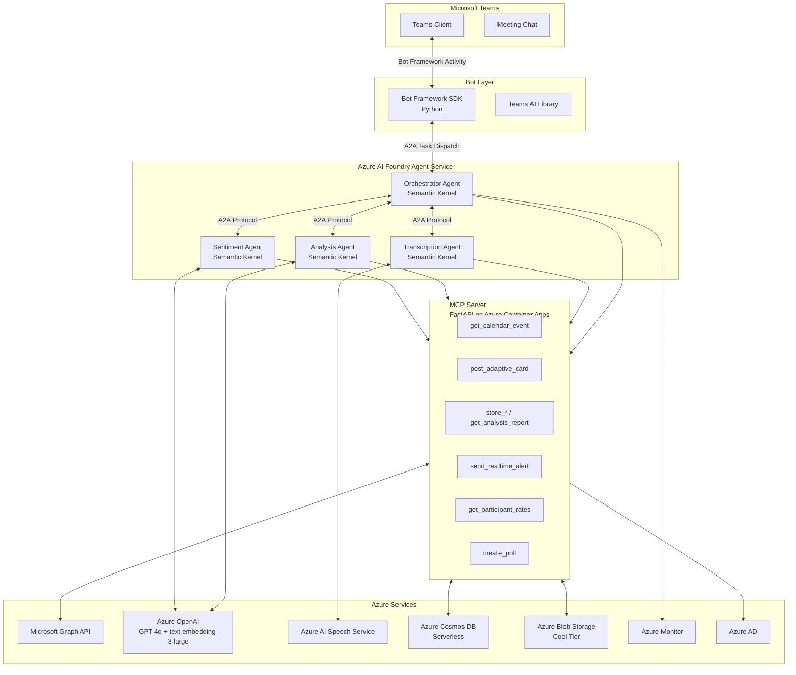
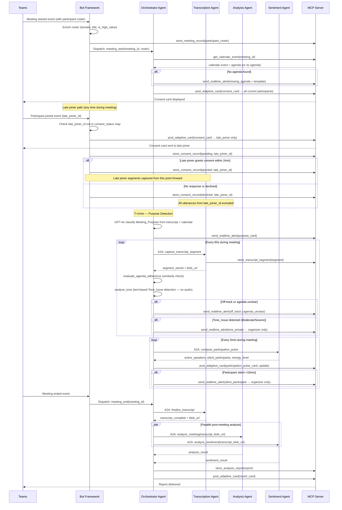
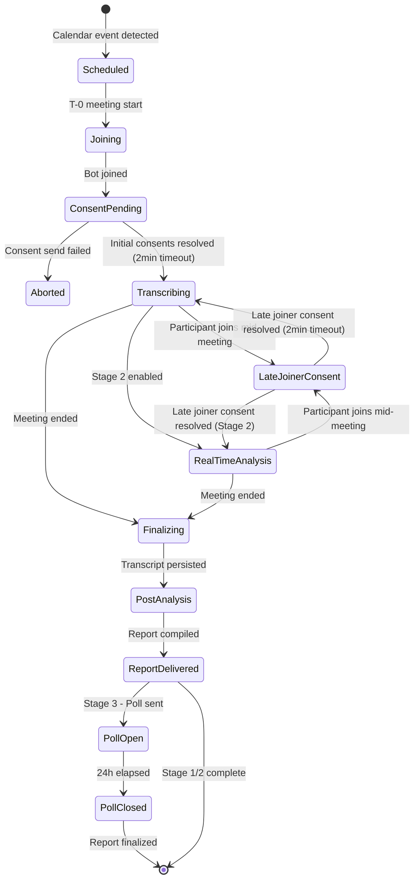
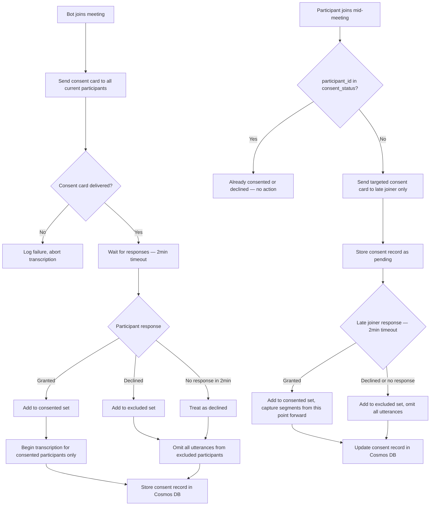

# Design Document: Teams Meeting Analysis Bot

## Overview

The Teams Meeting Analysis Bot is an AI-powered multi-agent system that automatically joins Microsoft Teams meetings, captures transcripts with participant consent, delivers proactive real-time insights during the meeting, and produces a deep post-meeting analysis report. The system is built on Azure AI Foundry with Semantic Kernel orchestration, a self-hosted MCP server, and Microsoft Bot Framework for Teams integration.

### Delivery Stages

| Stage | Timeline | Theme | Key Deliverables |
|---|---|---|---|
| Stage 1 | Weeks 1–2 | Proof of Value | Auto-join, consent (including late-joiner re-consent), participant roster capture, transcription, agenda extraction, post-meeting summary, A2A foundation, MCP core tools |
| Stage 2 | Weeks 3–4 | Real-Time Intelligence | Meeting purpose detection (T=2min), agenda availability alert (on join), off-track detection, participation pulse (every 5min), professional tone monitoring (text-based only), live cost tracker |
| Stage 3 | Weeks 5–6 | Deep Analysis | Sentiment, audio prosody (post-meeting batch only), agreement detection, relevance assessment, consent poll |
| Phase 2 | Post-MVP | Extended Platform | Video analysis, historical dashboard, PM tool integrations |

---

## Architecture

### High-Level Component Diagram



### A2A Communication Flow



### Meeting Lifecycle State Machine



---

## Framework Decisions

### Agent Orchestration: Semantic Kernel (Python) with Azure AI Foundry

**Decision: Semantic Kernel (Python) + Azure AI Foundry Agent Service**

Semantic Kernel is chosen over the alternatives for the following reasons:

| Framework | Assessment |
|---|---|
| **Semantic Kernel** | Native Azure AI Foundry integration, built-in A2A protocol support, first-class connectors for Microsoft Graph, Teams Bot Framework, and Azure OpenAI. Production-ready for enterprise Teams deployment. Chosen. |
| LangGraph | Excellent for complex stateful graphs, but requires manual Azure wiring for Foundry, Graph API, and Bot Framework. Adds 2–3 weeks of integration overhead with no functional benefit for this use case. |
| AutoGen | Research-oriented. Not production-ready for enterprise Teams deployment. Lacks stable Azure Foundry integration. |
| CrewAI | Good for role-based agent crews but lacks native Azure ecosystem connectors. Would require the same manual wiring as LangGraph. |

Semantic Kernel's `AgentGroupChat` and `KernelFunction` primitives map directly to the Orchestrator → Specialist agent topology. The Azure AI Foundry Agent Service handles agent hosting, scaling, and the A2A protocol transport layer, eliminating the need to build custom agent communication infrastructure.

### Frontend Dashboard: Fluent UI v9 (Phase 2 Only)

**Decision: Fluent UI v9 for Phase 2 dashboard; Adaptive Cards for all MVP in-meeting UI**

Fluent UI is Microsoft's open-source React component library — the same design system used in Teams, Outlook, and the Azure Portal. For the Phase 2 historical dashboard, Fluent UI v9 ensures the web app looks and feels native inside Teams (same fonts, colors, components, interaction patterns) and provides built-in Teams theme support and accessibility compliance.

For the MVP (Stages 1–3), all in-meeting UI is delivered via Adaptive Cards through the Bot Framework. Fluent UI is not needed until Phase 2.

### MCP Server: Self-Hosted on Azure Container Apps

**Decision: Self-hosted FastAPI MCP server on Azure Container Apps, registered in Azure AI Foundry as a tool provider**

MCP (Model Context Protocol) is an open standard originally from Anthropic, now widely adopted. It is not a managed Azure service — Azure AI Foundry supports MCP by allowing agents to register MCP servers as tool providers, but the server itself must be written and hosted by the developer.

Microsoft provides some pre-built MCP servers (GitHub, Azure DevOps, Bing) but nothing for Teams meeting data or Microsoft Graph meeting resources. Therefore, a custom MCP server is required.

The MCP server is implemented as a lightweight FastAPI (Python) application. Each tool is a thin authenticated wrapper around a Microsoft Graph API call or Azure storage operation — approximately 200–300 lines of Python total. It is hosted as an Azure Container App (serverless, scales to zero, cost-effective) and registered in Azure AI Foundry as a tool provider so all agents can call it uniformly.

---


---

## Azure AI Foundry Ownership Model

This section defines precisely what is managed inside Azure AI Foundry versus what is owned and versioned in your Git repositories. The guiding principle is: **Foundry owns runtime configuration and hosting; your repo owns all logic, prompts, and schemas.** Nothing that affects system behaviour should exist only inside Foundry with no corresponding source-controlled representation.

---

### Ownership split at a glance

| Concern | Owned by | Where |
|---|---|---|
| Agent system prompts (instructions) | Your repo | `agents/instructions/` as versioned `.md` files |
| Agent model config (model name, temperature, max_tokens) | Your repo | `agents/definitions/` as versioned `.yaml` files |
| Agent registration (name, ID, tool connections) | Azure AI Foundry | Created/updated by `deploy/register_agents.py` from your repo |
| A2A transport between agents | Azure AI Foundry | Managed entirely by Foundry — no code required |
| Agent scaling and hosting (post-meeting agents) | Azure AI Foundry | Managed entirely by Foundry — no container required |
| Orchestrator hosting (long-running, stateful) | Your repo | Deployed as Azure Container App from `agent-orchestrator/` |
| MCP server hosting | Your repo | Deployed as Azure Container App from `mcp-server/` |
| MCP server registration in Foundry | Azure AI Foundry | Registered once via `deploy/register_mcp.py` or Bicep |
| Model deployments (GPT-4o, embeddings) | Azure AI Foundry | Provisioned via `infra/` Bicep — not clicked in portal |
| Azure OpenAI connection | Azure AI Foundry | Provisioned via `infra/` Bicep |
| Cosmos DB / Blob / Speech connections | Azure AI Foundry | Provisioned via `infra/` Bicep |
| Evaluation runs and tracing | Azure AI Foundry | Used as observability tooling only — not source of truth |
| Prompt iteration / experimentation | Azure AI Foundry Playground | Scratch work only — must be committed to repo before deploy |

---

### What Azure AI Foundry manages for you (zero code required)

**Agent runtime hosting for Foundry-native agents.** The Analysis Agent, Sentiment Agent, and post-meeting Transcription Agent (Stage 3 batch) run as Foundry-native agents — no Docker image, no Container Registry, no Container App. Foundry hosts them entirely. You define them via the Azure AI Projects SDK; Foundry allocates compute, manages scaling, and exposes their A2A endpoint automatically.

**A2A protocol transport.** The Orchestrator dispatches tasks to specialist agents using Foundry's built-in A2A protocol. Foundry handles message routing, retries at the transport layer, and endpoint resolution. You write the task schemas; Foundry moves the messages.

**MCP tool discovery.** Once your MCP server is registered in Foundry's tool registry (a one-time setup step in `deploy/register_mcp.py`), all Foundry-native agents discover and call your tools automatically using Foundry's auth envelope. No hardcoded MCP URLs in agent code.

**Model endpoint management.** GPT-4o and `text-embedding-3-small` are deployed as named deployments inside your Foundry workspace. Agents reference them by deployment name (`gpt-4o-meeting-bot`), not by endpoint URL. Foundry handles throttling, quota management, and regional failover.

**Secrets and connections.** Foundry's connection store holds references to Cosmos DB, Blob Storage, and Azure AI Speech — authenticated via managed identity. Agents and the MCP server receive connections at runtime from Foundry without any secrets in code or environment variables.

---

### What your repo owns and deploys into Foundry

#### Agent definitions (`agents/definitions/`)

Each agent is defined by a YAML file that is the source of truth for everything Foundry needs to create or update the agent. The deploy script reads this file and calls the Azure AI Projects SDK — the Foundry portal reflects what the YAML says, not the other way around.

```yaml
# agents/definitions/analysis_agent.yaml
name: analysis-agent
description: Post-meeting analysis — agenda adherence, action items, participant relevance
model: gpt-4o-meeting-bot          # Foundry deployment name, not Azure OpenAI endpoint
temperature: 0.2
max_tokens: 4000
instructions_file: agents/instructions/analysis_agent_v1.md
tools:
  - mcp: meeting-bot-mcp-server    # Foundry MCP registry name
    tools_filter:
      - get_calendar_event
      - get_analysis_report
      - store_analysis_report
      - compute_similarity
response_format: json_object
```

```yaml
# agents/definitions/sentiment_agent.yaml
name: sentiment-agent
description: Post-meeting sentiment, participation scoring, prosody enrichment
model: gpt-4o-meeting-bot
temperature: 0.1
max_tokens: 3000
instructions_file: agents/instructions/sentiment_agent_v1.md
tools:
  - mcp: meeting-bot-mcp-server
    tools_filter:
      - get_analysis_report
      - store_analysis_report
      - compute_similarity
response_format: json_object
```

```yaml
# agents/definitions/transcript_agent.yaml
name: transcript-agent
description: Batch audio post-processing — prosody extraction and transcript enrichment (Stage 3)
model: gpt-4o-meeting-bot
temperature: 0.0
max_tokens: 1000
instructions_file: agents/instructions/transcript_agent_v1.md
tools:
  - mcp: meeting-bot-mcp-server
    tools_filter:
      - store_transcript_segment
      - store_meeting_record
response_format: json_object
```

#### Agent instructions (`agents/instructions/`)

System prompts are plain Markdown files, versioned in Git. The filename encodes the version — `analysis_agent_v1.md`, `analysis_agent_v2.md` — so you can diff prompt changes exactly like code changes, roll back with `git revert`, and tag releases that include prompt versions alongside code versions.

```
agents/
  instructions/
    analysis_agent_v1.md
    sentiment_agent_v1.md
    transcript_agent_v1.md
    orchestrator_v1.md     # loaded locally by Orchestrator container at startup
  definitions/
    analysis_agent.yaml
    sentiment_agent.yaml
    transcript_agent.yaml
```

The `instructions_file` field in each YAML is a relative path. The deploy script reads the file content and passes it as the `instructions` parameter to `client.agents.create_agent()` or `client.agents.update_agent()`. The prompt text never lives only in Foundry — Foundry is the runtime destination; your repo is the source of record.

**Prompt versioning rule:** The `instructions_file` field always points to a specific versioned filename (e.g. `analysis_agent_v2.md`). When a prompt changes, a new file is created and the YAML is updated to point to it. The old file is never deleted — it provides a complete audit trail of what instructions were active at any given Git commit. A PR that changes agent behaviour always includes both the new `_vN.md` file and the updated YAML reference, making prompt changes reviewable and reversible just like code changes.

#### Deploy script (`deploy/register_agents.py`)

This is the only path through which agents are created or updated in Foundry. Nobody edits agents through the Foundry portal directly. The script is idempotent — if the agent already exists it updates it; if not it creates it.

```python
from azure.ai.projects import AIProjectClient
from azure.identity import DefaultAzureCredential
import yaml, pathlib, json

WORKSPACE  = "https://<foundry-workspace>.api.azureml.ms"
SUB        = "<subscription-id>"
RG         = "<resource-group>"
PROJECT    = "<project-name>"

client = AIProjectClient(
    endpoint=WORKSPACE,
    credential=DefaultAzureCredential(),
    subscription_id=SUB,
    resource_group_name=RG,
    project_name=PROJECT,
)

def deploy_agent(definition_path: pathlib.Path):
    defn         = yaml.safe_load(definition_path.read_text())
    instructions = pathlib.Path(defn["instructions_file"]).read_text()
    tools        = build_tool_resources(defn.get("tools", []))

    existing = {a.name: a for a in client.agents.list_agents()}

    params = dict(
        model=defn["model"],
        instructions=instructions,
        temperature=defn.get("temperature", 0.2),
        tools=tools,
    )

    if defn["name"] in existing:
        agent = client.agents.update_agent(existing[defn["name"]].id, **params)
        print(f"Updated : {agent.name} ({agent.id})")
    else:
        agent = client.agents.create_agent(
            name=defn["name"],
            description=defn.get("description", ""),
            **params,
        )
        print(f"Created : {agent.name} ({agent.id})")

    # Persist agent ID so the Orchestrator can resolve it at runtime
    id_path = pathlib.Path(f"deploy/agent_ids/{defn['name']}.txt")
    id_path.parent.mkdir(exist_ok=True)
    id_path.write_text(agent.id)

def build_tool_resources(tools_config: list) -> list:
    # Resolves MCP registry name to Foundry ToolDefinition objects
    # Exact shape depends on azure-ai-projects SDK version — see Foundry MCP docs
    result = []
    for entry in tools_config:
        if "mcp" in entry:
            result.append({
                "type": "mcp",
                "mcp": {
                    "server_name": entry["mcp"],
                    "allowed_tools": entry.get("tools_filter", []),
                }
            })
    return result

if __name__ == "__main__":
    for defn_file in sorted(pathlib.Path("agents/definitions").glob("*.yaml")):
        deploy_agent(defn_file)
```

Agent IDs written to `deploy/agent_ids/` are committed to the repo. The Orchestrator reads them at container startup to resolve A2A dispatch targets without any hardcoded IDs in environment variables.

#### MCP server registration (`deploy/register_mcp.py`)

Run once per environment (dev / staging / prod). Registers your Container App MCP server URL in Foundry's tool registry under the name `meeting-bot-mcp-server`. All agent YAML files reference this registry name — the URL itself never appears in agent definitions.

```python
from azure.ai.projects import AIProjectClient
from azure.identity import DefaultAzureCredential
import os

client = AIProjectClient(
    endpoint=os.environ["FOUNDRY_WORKSPACE"],
    credential=DefaultAzureCredential(),
    subscription_id=os.environ["AZURE_SUBSCRIPTION_ID"],
    resource_group_name=os.environ["AZURE_RESOURCE_GROUP"],
    project_name=os.environ["FOUNDRY_PROJECT"],
)

client.connections.create_or_update(
    connection_name="meeting-bot-mcp-server",
    properties={
        "category": "CustomKeys",
        "target": os.environ["MCP_SERVER_URL"],   # e.g. https://mcp.<env>.azurecontainerapps.io
        "auth_type": "managed_identity",
        "metadata": {"type": "mcp"},
    }
)
print(f"MCP server registered: {os.environ['MCP_SERVER_URL']}")
```

---

### Orchestrator: self-hosted, dispatches to Foundry agents

The Orchestrator is a self-hosted Container App because it runs a stateful 60-second evaluation loop for the duration of each meeting. It uses the Foundry A2A protocol to dispatch tasks to Foundry-native agents, reading agent IDs from the `deploy/agent_ids/` state files at startup.

```python
from azure.ai.projects import AIProjectClient
from azure.identity import DefaultAzureCredential
from pathlib import Path
import json

class Orchestrator:
    def __init__(self):
        self.client = AIProjectClient(
            endpoint=FOUNDRY_WORKSPACE,
            credential=DefaultAzureCredential(),
            subscription_id=SUB,
            resource_group_name=RG,
            project_name=PROJECT,
        )
        # Resolve Foundry agent IDs from repo state files
        self.analysis_agent_id  = Path("deploy/agent_ids/analysis-agent.txt").read_text().strip()
        self.sentiment_agent_id = Path("deploy/agent_ids/sentiment-agent.txt").read_text().strip()

        # Load own system prompt from versioned file (not a Foundry-native agent)
        self.system_prompt = Path("agents/instructions/orchestrator_system_prompt_v1.md").read_text()

    def dispatch_post_meeting_analysis(self, meeting_id: str, transcript_blob_url: str) -> dict:
        thread = self.client.agents.create_thread()
        self.client.agents.create_message(
            thread_id=thread.id,
            role="user",
            content=json.dumps({
                "task": "analyze_meeting",
                "meeting_id": meeting_id,
                "transcript_blob_url": transcript_blob_url,
            })
        )
        run = self.client.agents.create_and_process_run(
            thread_id=thread.id,
            agent_id=self.analysis_agent_id,
        )
        messages = self.client.agents.list_messages(thread_id=thread.id)
        return json.loads(messages.data[0].content[0].text.value)
```

---

### Repository structure

```
repo/
│
├── agents/
│   ├── definitions/                    ← YAML source of truth for all Foundry-native agents
│   │   ├── analysis_agent.yaml
│   │   ├── sentiment_agent.yaml
│   │   └── transcript_agent.yaml
│   └── instructions/                   ← versioned system prompts — plain Markdown
│       ├── analysis_agent_v1.md
│       ├── sentiment_agent_v1.md
│       ├── transcript_agent_v1.md
│       └── orchestrator_system_prompt_v1.md
│
├── agent-orchestrator/                 ← self-hosted Container App
│   ├── orchestrator.py
│   ├── real_time_loop.py
│   └── Dockerfile
│
├── mcp-server/                         ← self-hosted Container App (FastAPI)
│   ├── main.py
│   ├── tools/
│   └── Dockerfile
│
├── teams-bot/                          ← Azure Bot Service
│   ├── bot.py
│   ├── consent_handler.py
│   └── Dockerfile
│
├── shared-models/                      ← internal Python package
│   ├── a2a_schemas.py
│   └── mcp_types.py
│
├── deploy/
│   ├── register_agents.py              ← idempotent Foundry agent create/update
│   ├── register_mcp.py                 ← MCP server registration in Foundry
│   └── agent_ids/                      ← Foundry-assigned agent IDs (committed to repo)
│       ├── analysis-agent.txt
│       ├── sentiment-agent.txt
│       └── transcript-agent.txt
│
└── infra/
    ├── main.bicep                      ← Foundry workspace, model deployments, connections
    ├── cosmos.bicep
    ├── blob.bicep
    └── container_apps.bicep
```

3 self-hosted containers (Orchestrator, MCP server, Teams bot) + 3 Foundry-native agents (Analysis, Sentiment, post-meeting Transcription). No container image required for any Foundry-native agent.

---

### CI/CD pipeline behaviour

| Trigger | What runs | What Foundry sees |
|---|---|---|
| PR touching `agents/instructions/*.md` | Prompt lint (token count, required section check) | Nothing — Foundry not touched until merge |
| Merge to `main` — changed `instructions/` or `definitions/` | `deploy/register_agents.py` | Agent instructions and/or config updated live in Foundry |
| Merge to `main` — changed `agent-orchestrator/` | Docker build → ACR push → Container App revision | Foundry unchanged |
| Merge to `main` — changed `mcp-server/` | Docker build → ACR push → Container App revision | MCP URL unchanged; Foundry tool registry unchanged |
| Merge to `main` — changed `infra/` | `az deployment group create` | Foundry workspace, model deployments, connections updated |
| New environment (dev / staging / prod) | `infra/` deploy → `register_mcp.py` → `register_agents.py` | Full Foundry workspace created from scratch — no portal clicks |

This pipeline guarantees that the state of Foundry in any environment is fully reproducible from the repo. Standing up a new environment requires three commands and no manual portal work.


## Components and Interfaces

### Bot (Teams Bot Framework SDK — Python)

The bot is the Teams-facing entry point. It handles all Teams activity events and delegates intelligence to the Orchestrator Agent.

**Responsibilities:**
- Register as a Teams application via Azure Bot Service and Teams App Manifest
- Subscribe to calendar events via Microsoft Graph webhook to detect new meetings
- Auto-join meetings at scheduled start time using Graph Communications API
- Deliver consent Adaptive Card on join to all current participants
- **Late joiner re-consent:** On every `participantJoined` Bot Framework event, check if the joining participant's `participant_id` exists in the meeting's `consent_status` map. If absent, immediately send a targeted consent card to that participant only. Apply the same 2-minute no-response-treated-as-declined rule. Begin capturing that participant's transcript segments only after consent is granted; exclude all prior utterances made before consent was resolved.
- **Recording status check:** On meeting join, check whether recording is enabled via Graph. If not enabled, send a private alert to the organizer: "Stage 3 prosody analysis will not be available — enable meeting recording to capture audio." Store `recording_enabled: boolean` in the meeting record.
- Render real-time cost tracker Adaptive Card (Stage 2), updating in-place every 60 seconds
- Deliver post-meeting report Adaptive Card
- Deliver consent poll (Stage 3)

**Key interfaces:**
```
POST /api/messages          # Bot Framework activity endpoint
POST /api/graph/webhook     # Graph change notification webhook
```

**Auto-join flow:** The bot subscribes to `calendarView` change notifications via Graph API. When a new meeting is detected, it schedules a join at the meeting start time using the Graph Communications API `createCall` endpoint, joining as a service participant.

**Participant data capture on join:** When the bot joins a meeting, the Bot Framework meeting join event provides the full participant roster. The bot enriches each participant with domain (internal vs external by comparing against tenant domain) and title from the Graph `GET /users/{id}` API, then stores a `participant_roster` document via `store_meeting_record`. This single upfront call replaces the need for `get_participants` and `get_participant_roles` MCP tools. The roster document includes: `participant_id`, `display_name`, `domain`, `is_external`, `title`, `is_high_value` (true if external OR title matches CEO/CTO/CFO/COO/CPO/CMO/CXO/President/VP/Director). Late joiners are added to this document when their consent is resolved.

### MCP Server (FastAPI on Azure Container Apps)

The MCP server is the tool layer between agents and external services. Agents never call Graph API or storage directly — all external calls go through MCP tools.

**Tool inventory by stage:**

| Stage | Tool | Description |
|---|---|---|
| 1 | `get_calendar_event` | Fetch meeting metadata and agenda from Graph API |
| 1 | `get_recording_status` | Check whether meeting recording is enabled via Graph API |
| 1 | `post_adaptive_card` | Send or update an Adaptive Card in a Teams channel or chat |
| 1 | `store_meeting_record` | Persist or update the meeting record document (participant roster, consent status, meeting state) |
| 1 | `store_transcript_segment` | Persist a single transcript segment to Blob Storage and its metadata to Cosmos DB |
| 1 | `store_consent_record` | Persist or update a participant consent decision (granted / declined / pending) |
| 1 | `store_analysis_report` | Persist the compiled analysis report to Cosmos DB and Blob Storage |
| 1 | `get_analysis_report` | Retrieve a prior analysis report by meeting ID |
| 1 | `compute_similarity` | Compute cosine similarity between a text input and a list of agenda topic strings; returns per-topic scores and max score. Embeddings are cached per meeting_id. |
| 2 | `send_realtime_alert` | Send a proactive in-meeting Adaptive Card notification |
| 2 | `get_participant_rates` | Retrieve seniority level and hourly rate per participant for cost tracking |
| 2 | `store_cost_snapshot` | Persist a meeting cost snapshot to Cosmos DB |
| 3 | `create_poll` | Create a Teams poll via Adaptive Card for consent validation |

Note: `get_transcript`, `get_participants`, and `get_participant_roles` are removed. Transcript blob URLs are passed directly via A2A task schemas. Participant data is captured from the Bot Framework meeting join event and stored in the meeting record — no separate Graph API call needed. All `store_*` tools validate their input against a fixed Pydantic schema before executing; a `VALIDATION_ERROR` is returned for non-conforming inputs, making Req 22.4 enforceable per tool. All tools are deployed from Stage 1 onward; tools not yet active for a given stage return `FEATURE_NOT_ENABLED` rather than 404, avoiding versioning complexity across deployments.

**Authentication:** All agent requests are authenticated via Azure AD managed identity tokens. The MCP server validates the bearer token on every request before executing any tool.

**Error contract:** All tool failures return:
```json
{
  "error": {
    "code": "GRAPH_UNAVAILABLE",
    "message": "Microsoft Graph API returned 503",
    "retryable": true
  }
}
```

### Orchestrator Agent (Semantic Kernel + Azure AI Foundry)

The Orchestrator is the top-level agent. It owns the meeting lifecycle and routes tasks to specialist agents via A2A.

**Responsibilities:**
- Receive meeting lifecycle events from the Bot (join, end)
- Retrieve calendar event and agenda via MCP
- Dispatch transcript capture tasks to Transcription Agent
- Stage 2: Run real-time evaluation loop every 60 seconds — evaluate agenda adherence, trigger alerts
- Stage 2: Detect meeting purpose within first 2 minutes using GPT-4o on opening transcript + calendar context; surface as Real_Time_Alert card
- Stage 2: Monitor professional tone continuously; classify Tone_Issues by severity; manage two-stage alert escalation (private organizer → whole meeting)
- Stage 2: Activate High-Value Participant Mode when external or C-level participants detected from meeting join event data
- On meeting end: dispatch parallel analysis tasks to Analysis Agent and Sentiment Agent
- Aggregate results and compile the Analysis Report
- Deliver report via MCP `post_adaptive_card`
- Log all A2A dispatches to Azure Monitor

**Real-time evaluation algorithm (Stage 2):**

```
Every 60 seconds:
1. Take the last 120 seconds of transcript segments (sliding window)
2. Concatenate segment text into a single string
3. Call MCP compute_similarity(text=window_text, agenda_topics=[...], meeting_id=meeting_id)
   — embeddings are pre-computed and cached by MCP at meeting start using text-embedding-3-small
4. If max similarity across all topics < 0.35 for 3 consecutive windows (3 minutes),
   trigger off-track alert
5. At T=5min: if no agenda topics have similarity > 0.4 in any window,
   trigger agenda-unclear alert
6. At T=8min: if agenda still unclear, trigger second alert with GPT-4o-generated
   suggested agenda from transcript so far
```

```
Meeting Purpose Detection (Stage 2):
1. On meeting join: retrieve calendar event subject and description
2. At T=2min: take first 2 minutes of transcript segments
3. Prompt GPT-4o with calendar context + transcript to classify purpose as one of:
   "Decision meeting" | "Status update" | "Brainstorming" | "Client presentation" | "Problem-solving"
4. If detected purpose conflicts with calendar subject → include mismatch flag
5. Surface result as Real_Time_Alert card to all participants
6. Every 5 minutes: re-evaluate purpose alignment; alert if diverged >5 consecutive minutes

Professional Tone Monitoring (Stage 2 — text-based only):
NOTE: Tone monitoring in Stage 2 is performed exclusively on transcript text using GPT-4o.
No audio or prosody signals are available during the live meeting. Audio-based pitch and
tone detection is deferred to Stage 3 post-meeting batch processing.

1. On meeting join: read `participant_roster` document from storage (populated by Bot on join)
   If any participant has `is_high_value: true` → activate High-Value Participant Mode
2. Every 60 seconds: analyze last 60 seconds of transcript TEXT for Tone_Issues
   (aggressive language, dismissive language, interruptions, profanity, disrespectful tone)
3. Classify severity: "Minor" | "Moderate" | "Severe"
4. If High-Value Participant Mode active: treat "Minor" as "Moderate"
5. On "Moderate" or "Severe": send private Real_Time_Alert to organizer only
   (include: detected issue, severity, participant who triggered it)
6. If same participant triggers same severity within 3 minutes of prior private alert:
   send constructive whole-meeting alert (no names, no quotes)
7. Log ALL detected Tone_Issues regardless of alert sent
```

**A2A task schemas:**

```json
// Dispatch to Transcription Agent
{
  "task": "capture_transcript_segment",
  "meeting_id": "string",
  "segment_window_seconds": 60
}

// Dispatch to Analysis Agent
{
  "task": "analyze_meeting",
  "meeting_id": "string",
  "transcript_blob_url": "string",
  "agenda": ["string"]
}

// Dispatch to Sentiment Agent
{
  "task": "analyze_sentiment",
  "meeting_id": "string",
  "transcript_blob_url": "string",
  "audio_blob_url": "string | null"
}

// Dispatch to Sentiment Agent: participation pulse
{
  "task": "compute_participation_pulse",
  "meeting_id": "string",
  "snapshot_number": "number"
}
```

**A2A response schemas:**

```json
// Response from Transcription Agent
{
  "task": "capture_transcript_segment",
  "status": "ok | error",
  "segments_captured": "number",
  "blob_url": "string",
  "gap_detected": "boolean",
  "error": "string | null"
}

// Response from Analysis Agent
{
  "task": "analyze_meeting",
  "status": "ok | partial | error",
  "agenda": ["string"],
  "agenda_source": "calendar | inferred | not_determined",
  "agenda_adherence": [],
  "time_allocation": [],
  "action_items": [],
  "sections_failed": ["string"],
  "error": "string | null"
}

// Response from Sentiment Agent
{
  "task": "analyze_sentiment",
  "status": "ok | partial | error",
  "participation_summary": [],
  "sections_failed": ["string"],
  "error": "string | null"
}

// Response from Sentiment Agent: participation pulse
{
  "task": "compute_participation_pulse",
  "status": "ok | error",
  "active_speakers": ["participant_id"],
  "silent_participants": ["participant_id"],
  "energy_level": "High | Medium | Low",
  "per_participant_engagement": [{"participant_id": "string", "indicator": "string"}],
  "error": "string | null"
}
```

**Retry policy:** If a specialist agent does not respond within 120 seconds, the Orchestrator retries once. On second failure, the corresponding report section is marked "Unavailable".

### Transcription Agent (Semantic Kernel + Azure AI Foundry)

**Responsibilities:**

Stage 1–2 (live transcript capture):
- Connect to Graph Communications API for live transcript stream
- Attribute each segment to the correct participant via Teams identity
- Buffer and persist segments to Blob Storage every ≤60 seconds
- Omit segments from participants who declined consent
- On meeting end: finalize transcript and notify Orchestrator

Stage 3 (batch audio post-processing — triggered after meeting ends):
- Trigger batch audio post-processing using Azure AI Speech batch transcription and prosody API
- Extract per-participant prosody features (speaking rate, pitch mean/variance) from the full meeting audio recording
- Correlate audio analysis results with transcript timestamps and participant identities
- Persist enriched prosody data to Blob Storage
- Notify Orchestrator when post-processing is complete

Note: No real-time audio processing occurs during the meeting. All audio analysis is deferred to Stage 3 batch post-processing after the meeting ends.

**Key integrations:**
- Microsoft Graph Communications API (`/communications/calls/{id}/transcripts`)
- Azure AI Speech Service (batch prosody analysis — Stage 3 only)
- Azure Blob Storage (transcript and audio persistence)

### Analysis Agent (Semantic Kernel + Azure AI Foundry)

**Responsibilities:**
- Retrieve calendar event and extract agenda (or infer from first 10% of transcript)
- Compute semantic similarity between agenda topics and transcript segments using `text-embedding-3-large`
- Classify agenda topics as Covered / Partially Covered / Not Covered
- Identify off-agenda discussion segments
- Calculate time allocation per agenda topic
- Extract action items using GPT-4o with structured output
- Stage 3: Detect participant agreement/disagreement on action items
- Stage 3: Assess participant relevance to agenda using the formula below
- Stage 3: Read participant job titles from the stored `participant_roster` document (no additional Graph API call needed)

**Participant relevance formula (Stage 3):**

```
Relevance score = (agenda_aligned_speaking_time / total_speaking_time) × 100

Where agenda_aligned_speaking_time = sum of duration of transcript segments
where cosine_similarity(segment_embedding, nearest_agenda_topic_embedding) >= 0.4

Classification:
- score >= 60%: "Highly Relevant"
- score >= 30%: "Relevant"
- score < 30%:  "Low Relevance"
- total_speaking_time == 0: "Observer"
```

**Model usage:**
- `text-embedding-3-large` — agenda vs. transcript semantic similarity
- `GPT-4o` — action item extraction, agreement detection, relevance assessment

### Sentiment Agent (Semantic Kernel + Azure AI Foundry)

**Responsibilities:**
- Compute per-participant sentiment using Azure AI Language Sentiment Analysis API (returns Positive/Neutral/Negative with confidence scores)
- Apply Azure AI Language Opinion Mining to extract aspect-level sentiment on key phrases (no custom labels needed)
- Identify sentiment shifts with timestamps
- Calculate speaking time percentage and turn count per participant
- Flag low participation (<2%) and dominant speakers (>50%)
- Stage 2: Compute participation snapshot every 5 minutes: active speakers, silent participants, speaking time distribution
- Stage 2: Calculate overall meeting energy level (High/Medium/Low) from aggregate text-based engagement signals (speaking frequency, turn count, turn length) — no audio signals available in Stage 2
- Stage 2: Detect participants silent for >10 consecutive minutes; notify Orchestrator for private organizer alert
- Stage 3: Incorporate prosody signals (speaking rate, pitch mean/variance) from post-meeting batch audio processing as raw numeric values in the report — these are not classified into custom labels and are only available when `recording_enabled: true`

**Model usage:**
- Azure AI Language Sentiment Analysis API — text sentiment (Positive/Neutral/Negative)
- Azure AI Language Opinion Mining — aspect-level sentiment on key phrases
- Azure AI Speech prosody features — speaking rate, pitch mean/variance as numeric signals (Stage 3)

---

## Data Models

### Meeting Record

```json
{
  "id": "meeting_{meeting_id}",
  "type": "meeting",
  "meeting_id": "string",
  "organizer_id": "string",
  "organizer_name": "string",
  "subject": "string",
  "start_time": "ISO8601",
  "end_time": "ISO8601 | null",
  "duration_minutes": "number | null",
  "participants": ["participant_id"],
  "consent_status": {
    "{participant_id}": {
      "consented": "boolean",
      "timestamp": "ISO8601",
      "late_joiner": "boolean",
      "join_time": "ISO8601"
    }
  },
  "stage": "joining | transcribing | analyzing | complete | aborted",
  "transcript_blob_url": "string | null",
  "audio_blob_url": "string | null",
  "analysis_report_id": "string | null",
  "created_at": "ISO8601",
  "updated_at": "ISO8601",
  "azure_region": "string",
  "retention_expires_at": "ISO8601",
  "recording_enabled": "boolean",
  "high_value_participant_mode": "boolean",
  "high_value_participants": ["participant_id"],
  "meeting_purpose": "Decision meeting | Status update | Brainstorming | Client presentation | Problem-solving | null",
  "meeting_purpose_mismatch": "boolean"
}
```

### Transcript Segment

```json
{
  "id": "seg_{meeting_id}_{sequence}",
  "type": "transcript_segment",
  "meeting_id": "string",
  "sequence": "number",
  "participant_id": "string",
  "participant_name": "string",
  "text": "string",
  "start_time": "ISO8601",
  "end_time": "ISO8601",
  "duration_seconds": "number",
  "prosody": {
    "speaking_rate_wpm": "number | null",
    "pitch_mean_hz": "number | null",
    "pitch_variance": "number | null"
  },
  "consent_verified": "boolean"
}
```

### Analysis Report

```json
{
  "id": "report_{meeting_id}",
  "type": "analysis_report",
  "meeting_id": "string",
  "generated_at": "ISO8601",
  "agenda": ["string"],
  "agenda_source": "calendar | inferred | not_determined",
  "agenda_adherence": [
    {
      "topic": "string",
      "status": "Covered | Partially Covered | Not Covered",
      "similarity_score": "number",
      "time_minutes": "number",
      "time_percentage": "number"
    }
  ],
  "off_agenda_segments": [
    {
      "topic_summary": "string",
      "start_time": "ISO8601",
      "end_time": "ISO8601",
      "duration_minutes": "number"
    }
  ],
  "preamble_duration_minutes": "number",
  "extended_duration_flag": "boolean",
  "action_items": ["action_item_id"],
  "participation_summary": [
    {
      "participant_id": "string",
      "participant_name": "string",
      "speaking_time_seconds": "number",
      "speaking_time_percentage": "number",
      "turn_count": "number",
      "participation_flag": "Low Participation | Dominant Speaker | null",
      "sentiment": "Positive | Neutral | Negative | Insufficient Data",
      "sentiment_shifts": [{"timestamp": "ISO8601", "from": "string", "to": "string"}],
      "opinion_mining_aspects": [{"aspect": "string", "sentiment": "positive | negative | neutral"}],
      "prosody": {
        "speaking_rate_wpm": "number | null",
        "pitch_mean_hz": "number | null"
      },
      "contribution_score": "number | null",
      "relevance": "Highly Relevant | Relevant | Low Relevance | Observer | null"
    }
  ],
  "final_meeting_cost": "number | null",
  "sections_unavailable": ["string"],
  "poll_id": "string | null",
  "poll_status": "pending | open | closed | null",
  "meeting_purpose": "string | null",
  "meeting_purpose_mismatch": "boolean",
  "high_value_participant_mode": "boolean",
  "tone_issues": [
    {
      "timestamp": "ISO8601",
      "participant_id": "string",
      "severity": "Minor | Moderate | Severe",
      "issue_type": "aggressive | dismissive | interruption | profanity | disrespectful",
      "private_alert_sent": "boolean",
      "meeting_alert_sent": "boolean"
    }
  ],
  "participation_pulse_snapshots": [
    {
      "snapshot_number": "number",
      "captured_at": "ISO8601",
      "active_speakers": ["participant_id"],
      "silent_participants": ["participant_id"],
      "energy_level": "High | Medium | Low"
    }
  ]
}
```

### Action Item

```json
{
  "id": "action_{meeting_id}_{sequence}",
  "type": "action_item",
  "meeting_id": "string",
  "sequence": "number",
  "description": "string",
  "owner_participant_id": "string",
  "owner_name": "string",
  "due_date": "ISO8601 | Not Specified",
  "transcript_timestamp": "ISO8601",
  "status": "Proposed | Confirmed | Disputed | Unresolved | Disputed by Poll",
  "agreement_evidence": ["string"],
  "disagreeing_participants": ["string"],
  "poll_responses": {
    "{participant_id}": "Confirm | Dispute | Abstain"
  }
}
```

### Meeting Cost Snapshot

```json
{
  "id": "cost_{meeting_id}_{snapshot_index}",
  "type": "cost_snapshot",
  "meeting_id": "string",
  "snapshot_index": "number",
  "captured_at": "ISO8601",
  "elapsed_minutes": "number",
  "active_participant_count": "number",
  "total_cost": "number",
  "currency": "string",
  "per_participant": [
    {
      "participant_id": "string",
      "participant_name": "string",
      "hourly_rate": "number | null",
      "elapsed_cost": "number | null",
      "excluded": "boolean"
    }
  ],
  "excluded_participant_count": "number"
}
```

### Consent Record

```json
{
  "id": "consent_{meeting_id}_{participant_id}",
  "type": "consent",
  "meeting_id": "string",
  "participant_id": "string",
  "participant_name": "string",
  "decision": "granted | declined | pending",
  "timestamp": "ISO8601",
  "revoked": "boolean",
  "revoked_at": "ISO8601 | null",
  "deletion_triggered": "boolean"
}
```

---

## Storage Design

### Azure Blob Storage Layout

```
Container: transcripts
  /{azure_region}/
    /{meeting_id}/
      /raw_transcript.jsonl          # Streaming transcript segments (JSONL)
      /final_transcript.json         # Finalized complete transcript
      /audio_recording.mp4           # Raw audio (Stage 3 / Phase 2 video)
      /tone_pitch_features.json      # Prosody analysis output (Stage 3)

Container: reports
  /{azure_region}/
    /{meeting_id}/
      /analysis_report.json          # Full analysis report snapshot

Container: exports
  /{azure_region}/
    /{participant_id}/
      /dsar_{request_id}.zip         # Data subject access request exports
```

Access tier: Cool for all containers (infrequent access, cost-optimized).
Lifecycle policy: Auto-delete blobs after configured retention period (30–365 days).

### Cosmos DB Container Design

Database: `meeting-analysis`

| Container | Partition Key | Document Types | Notes |
|---|---|---|---|
| `meetings` | `/meeting_id` | meeting, consent, cost_snapshot | All meeting-scoped documents co-located |
| `analysis` | `/meeting_id` | analysis_report, action_item, transcript_segment | Analysis results per meeting |
| `config` | `/tenant_id` | tenant_config, participant_rates | Tenant-level configuration |

Capacity mode: Serverless (pay-per-request, optimal for variable meeting load).

Indexing policy: Default (all paths indexed) for `meetings` and `config`. Custom policy for `analysis` — index `participant_id`, `status`, `meeting_id` only to reduce RU cost on large transcript segment collections.

### Embeddings Strategy

Embeddings are computed in-memory using numpy cosine similarity for all MVP stages (1–3). Azure AI Search is deferred to Phase 2 when meeting volume exceeds ~50/day.

Agenda topic embeddings are pre-computed at meeting start using `text-embedding-3-small` (for speed in the real-time evaluation loop) and `text-embedding-3-large` (for post-meeting analysis accuracy). All similarity computations run in-process within the Analysis Agent and Orchestrator Agent.

---

## Security and Privacy

### Azure AD App Registration — Minimum Required Permissions

| Permission | Type | Justification |
|---|---|---|
| `OnlineMeetings.ReadWrite.All` | Application | Auto-join meetings via Graph Communications API |
| `Calendars.Read` | Application | Subscribe to calendar events for auto-join |
| `CallRecords.Read.All` | Application | Access meeting transcript data |
| `Chat.ReadWrite.All` | Application | Send Adaptive Cards to meeting chat |
| `User.Read.All` | Application | Retrieve participant display names and job titles |
| `OnlineMeetingTranscript.Read.All` | Application | Read live and stored transcripts |

All permissions are application permissions (no delegated user context required for the bot). Permissions are granted by a tenant administrator during bot installation.

### Managed Identity Authentication

All agent-to-service authentication uses Azure AD managed identity — no secrets or connection strings in code or configuration.

```
Orchestrator Agent → Azure AI Foundry: System-assigned managed identity
MCP Server → Microsoft Graph API: System-assigned managed identity + app registration
MCP Server → Cosmos DB: System-assigned managed identity (Cosmos DB built-in RBAC)
MCP Server → Blob Storage: System-assigned managed identity (Storage Blob Data Contributor)
Bot → Azure Bot Service: System-assigned managed identity
```

### Data Residency Enforcement

- All Azure resources (Cosmos DB, Blob Storage, AI Foundry, Container Apps) are deployed to the tenant's designated Azure region.
- The MCP server validates `azure_region` on every store operation and rejects cross-region writes.
- Graph API calls use region-specific endpoints where available.
- Transcript data is never transmitted outside the configured region boundary.

### Consent Enforcement Pipeline



Consent revocation: If a participant revokes consent post-meeting, the system deletes their transcript segments from Blob Storage and Cosmos DB, re-runs analysis without their data, and updates the stored report — all within 48 hours.

---

## Correctness Properties

*A property is a characteristic or behavior that should hold true across all valid executions of a system — essentially, a formal statement about what the system should do. Properties serve as the bridge between human-readable specifications and machine-verifiable correctness guarantees.*


### Property 1: Consent precedes transcription

*For any* meeting join event, the consent notification card must be sent and acknowledged before any transcript segment is captured or stored. No transcript data should exist in storage for a meeting where the consent card was never successfully delivered.

**Validates: Requirements 2.1, 2.4**

### Property 2: Consent exclusion is total

*For any* meeting transcript and any participant who declined consent, zero transcript segments attributed to that participant should appear in the stored transcript, the analysis report, or any downstream output. This holds regardless of when during the meeting the participant declined or joined. For late joiners who declined or did not respond within the 2-minute window, no segments captured after their join time should appear.

**Validates: Requirements 2.3, 3.5**

### Property 3: Consent record round-trip

*For any* participant consent decision (granted or declined), storing the consent record and then retrieving it should return the same decision, participant ID, meeting ID, and a non-null timestamp.

**Validates: Requirements 2.5**

### Property 4: Transcript segment attribution invariant

*For any* transcript segment produced by the Transcription Agent, the `participant_id` field must match the Teams identity of the speaker who produced that segment, and the segment must not be attributed to a participant who was not present in the meeting.

**Validates: Requirements 3.2**

### Property 5: Transcript persistence latency invariant

*For any* transcript segment captured during a live meeting, the elapsed time between the segment's `end_time` and its persistence timestamp in Blob Storage must not exceed 60 seconds.

**Validates: Requirements 3.4**

### Property 6: Agenda topic length invariant

*For any* agenda extracted or inferred by the Analysis Agent, every topic string in the resulting ordered list must have a character length of 200 or fewer. No topic string may be null or empty.

**Validates: Requirements 4.3**

### Property 7: Similarity score range invariant

*For any* agenda topic and transcript segment pair processed by the Analysis Agent, the computed semantic similarity score must be a floating-point value in the closed interval [0.0, 1.0].

**Validates: Requirements 5.1**

### Property 8: Agenda classification completeness

*For any* agenda topic that has been processed by the Analysis Agent, the topic's classification must be exactly one of: "Covered", "Partially Covered", or "Not Covered". No topic may have a null or unrecognized classification status.

**Validates: Requirements 5.2**

### Property 9: Time allocation percentages sum to 100

*For any* analysis report, the sum of time allocation percentages across all agenda topics and the preamble segment must equal 100% (within a floating-point tolerance of ±0.1%). Each individual percentage must be a non-negative number.

**Validates: Requirements 6.3**

### Property 10: Action item schema completeness

*For any* action item extracted by the Analysis Agent, the item must contain: a non-empty description, an owner participant ID, a due date field (either a valid date or the string "Not Specified"), a transcript timestamp, and a status of either "Proposed" or "Confirmed".

**Validates: Requirements 7.1, 7.2, 7.3, 7.4**

### Property 11: Sentiment classification validity

*For any* participant with 50 or more words of transcript contribution, the Sentiment Agent must produce a sentiment classification of exactly one of: "Positive", "Neutral", or "Negative". For any participant with fewer than 50 words, the classification must be exactly "Insufficient Data".

**Validates: Requirements 9.1, 9.5**

### Property 12: Speaking time percentages sum to 100

*For any* meeting with at least one consenting participant, the sum of all participant speaking time percentages in the analysis report must equal 100% (within ±0.1%). Each individual percentage must be non-negative.

**Validates: Requirements 10.1**

### Property 13: Participation flagging thresholds

*For any* participant in a meeting, if their speaking time percentage is less than 2%, they must be flagged as "Low Participation"; if their speaking time percentage exceeds 50%, they must be flagged as "Dominant Speaker"; otherwise the flag must be null. These flags are mutually exclusive.

**Validates: Requirements 10.4, 10.5**

### Property 14: Real-time alert rate limiting

*For any* sequence of real-time alerts sent during a meeting, no two alerts of the same alert type should have timestamps within 5 minutes of each other. The alert throttle state must be maintained independently per alert type.

**Validates: Requirements 12.6**

### Property 15: Meeting cost calculation correctness

*For any* set of participants with known hourly rates and a given elapsed meeting duration, the computed total Meeting_Cost must equal the sum of (elapsed_hours × hourly_rate) for each participant with available rate data. Participants with unavailable rates must be excluded from the total and counted in `excluded_participant_count`.

**Validates: Requirements 13.2, 13.5**

### Property 16: Cost snapshot count invariant

*For any* completed meeting of duration D minutes, the number of cost snapshots stored in Cosmos DB must equal floor(D / 5), with each snapshot's `elapsed_minutes` field increasing monotonically by 5.

**Validates: Requirements 13.7**

### Property 17: Poll structure completeness

*For any* analysis report containing N action items, the generated consent poll must contain exactly N poll entries — one per action item — and each entry must offer exactly the three response options: "Confirm", "Dispute", and "Abstain".

**Validates: Requirements 16.2**

### Property 18: Disputed-by-poll majority rule

*For any* action item in a closed poll, if the count of "Dispute" responses is strictly greater than the count of "Confirm" and "Abstain" responses combined (i.e., a strict majority), the action item's status must be set to "Disputed by Poll". Otherwise the status must not be "Disputed by Poll".

**Validates: Requirements 16.5**

### Property 19: Consent revocation deletes all participant data

*For any* participant who revokes consent after a meeting, querying Blob Storage and Cosmos DB for transcript segments attributed to that participant must return zero results after the deletion process completes. The analysis report must be regenerated without that participant's data.

**Validates: Requirements 17.4**

### Property 20: MCP error response structure

*For any* MCP server tool call that fails due to a downstream service error, the response must be a JSON object containing exactly the fields: `error.code` (non-empty string), `error.message` (non-empty string), and `error.retryable` (boolean). No other error format is acceptable.

**Validates: Requirements 19.3**

### Property 21: MCP input validation rejects invalid inputs

*For any* MCP server tool call with input parameters that do not conform to the tool's defined JSON schema, the server must return a validation error response and must not execute the tool's underlying logic. Valid inputs must never be rejected.

**Validates: Requirements 19.4**

### Property 22: Meeting purpose classification validity

*For any* meeting where purpose detection runs, the classified Meeting_Purpose must be exactly one of: "Decision meeting", "Status update", "Brainstorming", "Client presentation", "Problem-solving". No null or unrecognized value is acceptable after the 2-minute detection window.

**Validates: Requirements 14.2**

### Property 23: High-value participant mode activation

*For any* meeting where at least one participant is identified as external (non-tenant domain) OR holds a C-level/senior title, the meeting record's `high_value_participant_mode` field must be `true`. If no such participant exists, the field must be `false`.

**Validates: Requirements 16.1, 16.2**

### Property 24: Tone issue private-before-public escalation

*For any* detected Tone_Issue that results in a whole-meeting alert, there must exist a prior private organizer alert for the same participant and same severity within the preceding 3 minutes. A whole-meeting alert must never be sent without a prior private alert.

**Validates: Requirements 16.6, 16.7**

### Property 25: Whole-meeting tone alert anonymity

*For any* whole-meeting tone alert sent by the bot, the alert text must not contain the participant's display name, participant ID, or any direct quote from the problematic transcript segment.

**Validates: Requirements 16.8**

### Property 26: Participation pulse snapshot interval

*For any* meeting of duration D minutes, the number of participation pulse snapshots must equal floor(D / 5). Each snapshot's `snapshot_number` must increment by 1 and `captured_at` timestamps must be at least 4.5 minutes apart.

**Validates: Requirements 15.1, 15.3**

### Property 27: Late joiner consent card delivery

*For any* participant who joins a meeting after the initial consent card has been sent, and whose `participant_id` is not present in the meeting record's `consent_status` map at the time of their join event, the bot must send a targeted consent card to that participant within 60 seconds of the join event. No transcript segments attributed to that participant may be stored before their consent decision is recorded. If no response is received within 2 minutes of the consent card being sent, the participant's status must be set to declined.

**Validates: Requirements 2.1, 2.3, 2.5**

### Property 28: Tone monitoring uses transcript text only in Stages 1 and 2

*For any* Tone_Issue detected and logged during a live meeting in Stage 1 or Stage 2, the detection must be derived solely from transcript text segments. No audio stream, prosody feature, or Speech Service signal may contribute to a real-time Tone_Issue classification during the live meeting. Audio-derived tone signals may only appear in the post-meeting Analysis_Report when Stage 3 batch processing is complete.

**Validates: Requirements 16.3, 16.4 (text-only constraint), 3.8 (Stage 3 batch only)**

---

## Error Handling

### Agent Failure Handling

| Failure Scenario | Detection | Response |
|---|---|---|
| Specialist agent timeout (>120s) | Orchestrator timeout | Retry once; mark section "Unavailable" on second failure |
| Bot fails to auto-join meeting | Join attempt timeout (60s) | Log failure with meeting ID + reason code; notify organizer |
| Consent card delivery failure (initial) | Bot Framework activity error | Abort transcription; log failure |
| Consent card delivery failure (late joiner) | Bot Framework activity error | Treat late joiner as declined; log failure with participant ID and meeting ID; exclude all utterances |
| Transcription connection interrupted | Graph API disconnect event | Reconnect within 10s; log gap with start/end timestamps |
| MCP tool call failure | HTTP error / timeout | Return structured error with `retryable` flag; agent decides retry |
| Audio post-processing failure | Speech Service error | Log failure; mark participant audio analysis as "Unavailable" |
| Report generation exceeds 10 minutes | Orchestrator timer | Send status message to organizer with estimated completion |

### MCP Server Error Codes

| Code | Meaning | Retryable |
|---|---|---|
| `GRAPH_UNAVAILABLE` | Microsoft Graph API returned 5xx | true |
| `GRAPH_FORBIDDEN` | Insufficient Graph API permissions | false |
| `COSMOS_WRITE_FAILED` | Cosmos DB write operation failed | true |
| `BLOB_WRITE_FAILED` | Blob Storage write operation failed | true |
| `VALIDATION_ERROR` | Input parameters failed schema validation | false |
| `CONSENT_REQUIRED` | Operation blocked — participant consent not granted | false |
| `REGION_VIOLATION` | Cross-region data write attempted | false |
| `FEATURE_NOT_ENABLED` | Tool called before its stage is active | false |
| `LATE_JOINER_CONSENT_FAILED` | Consent card delivery to late joiner failed | false |

### Retry Policy

- MCP tool calls: 3 retries with exponential backoff (1s, 2s, 4s) for retryable errors
- A2A agent dispatch: 1 retry after 120s timeout
- Graph API subscriptions: Automatic renewal 24 hours before expiry
- Blob Storage writes: 3 retries with 500ms backoff

---

## Testing Strategy

### Dual Testing Approach

Both unit tests and property-based tests are required. They are complementary:

- **Unit tests** verify specific examples, integration points, edge cases, and error conditions
- **Property-based tests** verify universal properties across many generated inputs

Unit tests should be focused and minimal — avoid writing unit tests for behaviors already covered by property tests.

### Property-Based Testing

**Library:** `hypothesis` (Python) — the standard property-based testing library for Python, with built-in strategies for generating structured data.

**Configuration:** Each property test must run a minimum of 100 iterations (`@settings(max_examples=100)`).

**Tag format:** Each property test must include a comment referencing the design property:
```
# Feature: teams-meeting-analysis-bot, Property {N}: {property_title}
```

Each correctness property defined above must be implemented by exactly one property-based test.

**Example property test structure:**

```python
from hypothesis import given, settings, strategies as st

# Feature: teams-meeting-analysis-bot, Property 9: Time allocation percentages sum to 100
@given(st.lists(st.floats(min_value=0, max_value=100), min_size=1))
@settings(max_examples=100)
def test_time_allocation_sums_to_100(raw_durations):
    total = sum(raw_durations)
    if total == 0:
        return  # degenerate case
    percentages = [d / total * 100 for d in raw_durations]
    assert abs(sum(percentages) - 100.0) < 0.1
```

### Unit Test Focus Areas

- Bot Framework activity handler routing (meeting start, end, consent response events, `participantJoined` late joiner event)
- Consent card rendering — correct Adaptive Card JSON structure for both initial broadcast and targeted late joiner card
- Late joiner consent logic — participant already in `consent_status` map is not re-sent a card; new participant not in map always receives card
- Late joiner 2-minute timeout — non-response correctly recorded as declined, utterances excluded
- MCP server tool input validation — schema rejection for each of the typed `store_*` tools independently
- MCP server `FEATURE_NOT_ENABLED` response — Stage 2/3 tools return correct error when called in Stage 1
- MCP server `compute_similarity` — score range [0.0, 1.0], correct max_score returned, empty agenda_topics edge case
- MCP server error response format — all required fields present (`error.code`, `error.message`, `error.retryable`)
- Agenda extraction from calendar event body (various formats)
- Action item schema validation — all required fields present
- Cost calculation with missing participant rates
- Poll majority rule edge cases (tie, all abstain, single participant)
- Consent revocation — deletion confirmation
- Recording status check — `recording_enabled: false` triggers private organizer alert

### Integration Test Focus Areas

- End-to-end meeting lifecycle with mock Graph API and mock Azure OpenAI
- Late joiner full flow — join event → consent card sent → grant/decline → transcript inclusion/exclusion verified in Blob and Cosmos
- A2A task dispatch and response handling between Orchestrator and specialist agents
- `compute_similarity` MCP tool — embedding cache hit on second call for same `meeting_id`, cache miss on new meeting
- Blob Storage write/read round-trip for transcript segments via `store_transcript_segment`
- Cosmos DB write/read round-trip for analysis reports via `store_analysis_report` and `get_analysis_report`
- Typed `store_*` tool schema enforcement — wrong document type sent to wrong tool returns `VALIDATION_ERROR`, not a silent write

---

## Stage-by-Stage Delivery Plan

### Stage 1 — Proof of Value (Weeks 1–2)

**What gets built:**
- Azure AD app registration with minimum required Graph API permissions
- Bot Framework SDK application with Teams App Manifest
- Graph calendar webhook subscription for auto-join
- Consent Adaptive Card delivery to all participants on join; re-consent flow for late joiners (targeted card on `participantJoined` event, 2-minute timeout, treat non-response as declined)
- Recording status check on join; private organizer alert if recording not enabled
- Consent record storage (granted / declined / pending) per participant per meeting
- Transcription Agent: Graph Communications API transcript capture, speaker attribution, Blob Storage persistence
- Analysis Agent: agenda extraction (calendar + inference), agenda adherence scoring (via `compute_similarity` MCP tool), time allocation, action item extraction
- Sentiment Agent: speaking time percentage, turn count, participation flags
- Orchestrator Agent: meeting lifecycle management, A2A dispatch, report compilation
- MCP Server (FastAPI): full tool set deployed from day one with stage feature flags — core tools active: `get_calendar_event`, `get_recording_status`, `post_adaptive_card`, `store_meeting_record`, `store_transcript_segment`, `store_consent_record`, `store_analysis_report`, `get_analysis_report`, `compute_similarity`
- Post-meeting Adaptive Card report delivery
- Cosmos DB + Blob Storage setup with data residency enforcement
- Azure Monitor logging for A2A dispatches and failures

**Dependencies:** Azure AI Foundry workspace, Azure OpenAI deployment (GPT-4o + text-embedding-3-large), Azure Bot Service registration, Teams tenant admin consent for Graph API permissions.

**Stage 1 demo:** Bot auto-joins a scheduled Teams meeting, sends consent card, captures transcript, and delivers a post-meeting Adaptive Card showing agenda adherence, time allocation, action items, and participation breakdown.

---

### Stage 2 — Real-Time Intelligence (Weeks 3–4)

**What gets built:**
- Orchestrator real-time evaluation loop (60-second polling against live transcript text)
- Agenda clarity detection (5-minute and 10-minute alert triggers) using `compute_similarity` MCP tool
- Off-track detection (3-consecutive-minute deviation trigger)
- Alert throttling (max 1 alert per type per 5-minute window) — throttle state stored in meeting record in Cosmos DB
- Professional tone monitoring — text-based only using GPT-4o on transcript segments; no audio or prosody signals during live meeting
- Real-time Meeting Cost Tracker Adaptive Card (in-place update every 60 seconds)
- MCP Server: activate Stage 2 tools — `send_realtime_alert`, `get_participant_rates`, `store_cost_snapshot`
- Participant rate data store in Cosmos DB `config` container
- Final meeting cost included in Analysis Report

**Dependencies:** Stage 1 complete. Participant rate data populated in Cosmos DB.

**Stage 2 demo:** During a live meeting, the bot sends an agenda clarity alert at the 5-minute mark, detects an off-topic discussion and sends a refocus alert, displays a live cost tracker card that updates every minute, and sends a private organizer alert when unprofessional language is detected in the transcript.

---

### Stage 3 — Deep Analysis (Weeks 5–6)

**What gets built:**
- Audio post-processing pipeline triggered on meeting end (Azure AI Speech batch API) — no real-time audio processing during the meeting
- Prosody feature extraction (speaking rate, pitch mean/variance) per participant from the full recording file; requires `recording_enabled: true` in meeting record
- Timestamp calibration step: anchor Graph transcript segment timestamps against audio recording timeline to align prosody data with transcript segments correctly
- Blob Storage persistence of tone and pitch features alongside finalized transcript
- Sentiment Agent extended: combined text + audio engagement score using prosody signals where available; graceful fallback to text-only when `recording_enabled: false`
- Analysis Agent extended: participant agreement detection on action items, participant relevance assessment
- Consent poll delivery via `create_poll` MCP tool (Adaptive Card poll)
- Poll response collection and 24-hour close timer
- Analysis Report update with poll results and "Disputed by Poll" reclassification
- MCP Server: activate Stage 3 tool — `create_poll`

**Dependencies:** Stage 2 complete. Azure AI Speech Service deployment with prosody analysis enabled. Meeting recording must be enabled by the organizer for audio features to be available.

**Stage 3 demo:** Post-meeting report includes per-participant sentiment classification, prosody-enriched tone labels, engagement scores, agreement status on each action item with supporting transcript excerpts, and participant relevance ratings. Where recording was not enabled, the report clearly indicates audio analysis is unavailable rather than marking sections as "Unavailable" without explanation. A consent poll is sent to all participants and the report is updated when the poll closes.

---

### Phase 2 — Post-MVP (Post Week 6)

**What gets built:**
- Historical analysis dashboard (React + Fluent UI v9, Azure Static Web App)
- Azure AD SSO for dashboard
- Aggregated metrics across meetings (agenda adherence trends, cost trends, participation trends)
- Microsoft Planner / Jira action item sync
- Video analysis pipeline (Azure AI Vision, requires separate consent)

**Dependencies:** Stage 3 complete. Sufficient meeting history in Cosmos DB for meaningful trend analysis.
