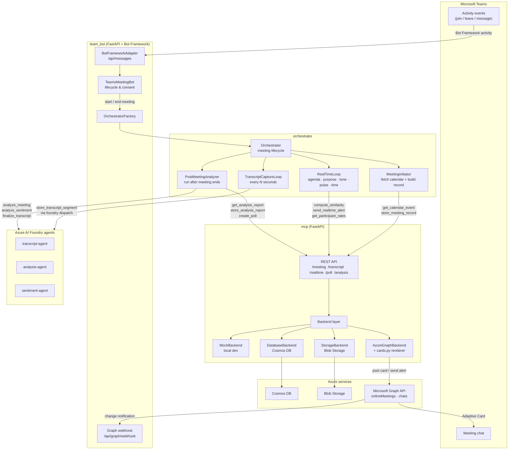

# Meeting Analyzer Monorepo

A modular meeting analysis project built around a FastAPI-based MCP server, an orchestrator for meeting lifecycle coordination, and agent definitions for specialist tasks.

## Repository Overview

- `mcp/`
  - Contains the Microservice Control Plane (MCP) server implementation.
  - Built with FastAPI.
  - Hosts API routes for meeting data, transcript capture, similarity services, and other analysis operations.
  - Uses pluggable backend implementations, with a `mock` backend enabled by default.

- `orchestrator/`
  - Hosts the meeting lifecycle coordinator and orchestration logic.
  - Includes meeting initiation, real-time monitoring, and post-meeting analysis flows.
  - Interacts with `McpClient` and `FoundryClient` to delegate work to specialist agents.
  - Contains configuration, clients, and report-building utilities.

- `shared_models/`
  - Defines the shared pydantic schemas and typed models used for agent-to-agent communication.
  - Includes task and response contracts such as transcript capture, sentiment analysis, and meeting analysis.
  - Ensures consistent data exchange across the orchestrator, agents, and MCP server.

- `agents/`
  - Holds agent registration artifacts and instructions.
  - `definitions/` contains YAML agent definitions used when registering agents with the MCP platform.
  - `instructions/` contains agent behavior prompt instructions.

- `deploy/`
  - Contains deployment helper scripts.
  - `register_agents.py` registers or updates specialist agents using the definitions and instructions in `agents/`.
  - `register_mcp.py` verifies the MCP server URL and confirms service reachability before deployment.

- `team_bot/`
  - Python Teams Bot Framework service.
  - Handles Teams activity events, lifecycle orchestration, consent cards, and delegates work to the orchestrator and MCP server.

## Key Files

- `run-dev.sh`
  - Local development script — start services, install dependencies, initialise `.env`.

- `run-tests.sh`
  - Test runner for all modules with grouped summary output.

- `deploy.sh`
  - Azure deployment script — provision infra, build/push images, assign RBAC, register agents.

- `mcp/main.py`
  - FastAPI application entrypoint for the MCP server.

- `orchestrator/orchestrator.py`
  - Primary meeting lifecycle coordinator.

- `shared_models/a2a_schemas.py`
  - Shared agent communication schemas across the system.

## How it Fits Together

1. `orchestrator/` manages meeting start/end events and background loops.
2. It uses `shared_models/` schemas to build typed tasks.
3. It dispatches those tasks to specialist agents configured in `agents/`.
4. The `mcp/` service provides the API surface and backend support for data storage, similarity search, and transcript handling.
5. `deploy/` scripts prepare the MCP endpoint and agent registrations for deployment.

## System Architecture

**Runtime flows**

| Flow | Path |
|------|------|
| Meeting start | Teams → Bot → Orchestrator → MeetingInitiator → MCP (calendar + record) |
| Transcript capture | Orchestrator loop → Foundry → transcript-agent → MCP store |
| Real-time alerts | Orchestrator loop → MCP send_realtime_alert → GraphBackend → cards.py → Graph API → meeting chat |
| Meeting end | Teams → Bot → Orchestrator → PostMeetingAnalyzer → Foundry agents (parallel) → MCP report |
| Graph proactive join | Graph webhook → Bot → GraphSubscriptionService → Bot Framework proactive |

## Developer workflow

Use `manage.sh` for local operations.

- `./run-dev.sh env:init`
  - Create a local `.env` from `.env.example` if needed.

- `./run-dev.sh install`
  - Installs dependencies for `mcp/`, `orchestrator/`, and `team_bot/` into `.venv`.

- `./run-dev.sh mcp`
  - Starts the MCP server on `MCP_PORT` (default `8000`).

- `./run-dev.sh bot`
  - Starts the Teams bot service on `BOT_PORT` (default `3978`).

- `./run-dev.sh all`
  - Starts both MCP and bot services together on separate ports.

- `./run-dev.sh`
  - Prints guidance for the orchestrator component; the orchestrator is used internally by the bot and is not launched as a standalone server.

- `./run-tests.sh mcp`
  - Runs only MCP server tests.

- `./run-tests.sh orchestrator`
  - Runs only orchestrator tests.

- `./run-tests.sh bot`
  - Runs only team bot tests.

- `./run-tests.sh`
  - Runs all test suites and prints grouped module summaries at the end.
  - Output format is like:
    - `MCP: 10 failed, 2 passed`
    - `Orchestrator: 20 passed, 1 failed`
    - `Team Bot: 4 passed`

## Notes

- The MCP backend is configurable, with mock backends available for local development.
- Azure backend wiring is referenced in `mcp/main.py` but not implemented yet.
- `team_bot/` is the Teams bot service and uses the orchestrator internally for meeting lifecycle coordination.
